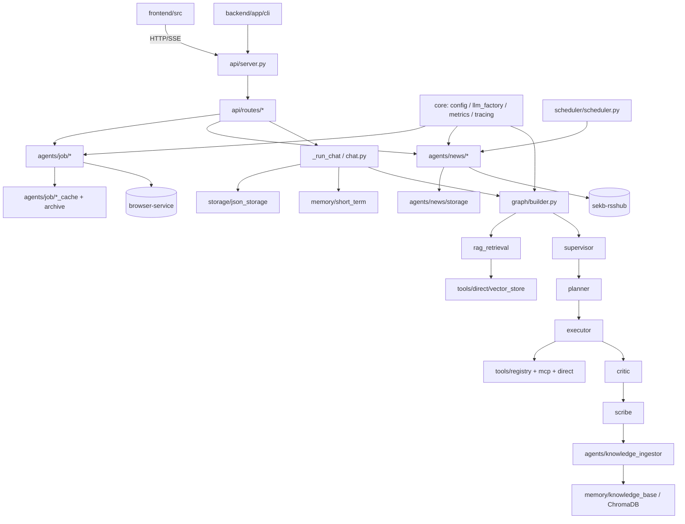
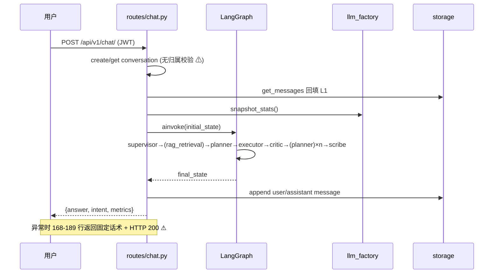
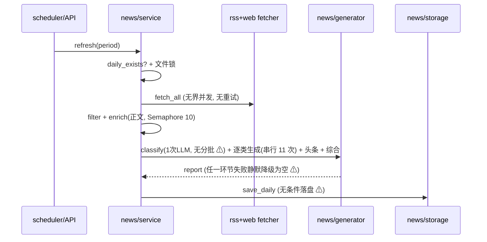

# 01 · 工程评审报告（全域）

> 评审日期：2026-09-08
> 评审范围：`backend/app`(107 .py) + `backend/tests`(34 .py) + `frontend/src`(31 ts/tsx) + `frontend/tests`(6) + `deploy`(21) + `docs`(23 .md) + `prompt`(13 .md) + `browser-service` + Docker/CI
> 方式：**只读评审**（未修改任何生产代码/配置，仅新增本报告目录）
> 标注约定：**【事实】** = 有 `文件:行号` 证据；**【推断】** = 基于事实的经验判断，需实机验证
> 路径约定：相对仓库根 `SelfEvolvingKnowledgeBase/`

---

## 1. 执行摘要

### 1.1 整体健康度评分（10 分制，权重见 03 号文档）

| 维度 | 评分 | 一句话结论 |
|---|---|---|
| 架构与代码结构 | 6.5 | 分层清晰、抽象到位，但装配层与路由层堆积了超长函数与三份重复实现 |
| Agent 能力（本次重点） | 6.0 | PDCA 骨架完整、可运行；但反思循环的"策略化""重写分支""统计回路"三条链是断的 |
| 记忆 / RAG / 知识库 | 5.5 | L3 已通，但入库闸门失效、无驱逐、纯向量无混合检索，与《RAG常见问题汇总》的 20 条对账命中 9 条未治理 |
| 可靠性与可观测 | 4.5 | Tracing 空壳、半数指标零埋点、全链路静默降级 —— **故障不可见是最大系统性风险** |
| 安全与多租户 | 4.0 | 存在 1 个确定的越权点、JWT 三连弱项、限流整体关闭 |
| 性能与成本 | 5.0 | 主干可接受；news/job 两条新链路无并发、无缓存、无预算 |
| 数据与存储 | 5.0 | JSON 原子写做得对，但无锁、无回收、无迁移路径 |
| 前端工程 | 6.0 | 无 XSS 面是亮点；但静默失败、any 密度、2MB 单包 |
| 部署 / CI / 监控 | 5.0 | 栈齐全；灰度链路实际不可用、恢复脚本不完整、CI 两处非阻断 |
| 文档工程 | 4.5 | 23 篇很勤奋，但主文档已漂移、4 份部署手册重复、8 篇孤儿、14 条与代码冲突 |
| **加权总分** | **5.4** | **"能跑、能用、但看不见自己什么时候坏"** |

### 1.2 三个最危险的单点

1. **故障不可见（系统性）** —— `chat.py:168-189` 把整个 LangGraph 异常吞成"降级回复 + HTTP 200"；`critic.py:164-175` 评估异常时降级为 `passed=True`；`metrics.py` 有 4 处 `except: pass`；`bootstrap.py:137-140` 把 tracing collector 返回值丢弃。**结论：线上出问题时，日志、指标、链路、响应码、前端 UI 五处都会显示为"正常"。**
2. **跨用户越权（确定性漏洞）** —— `backend/app/api/routes/chat.py:124-131` 只判断会话是否存在，未校验归属；随后 `:214/:230` 把当前用户的消息追加进他人会话。而 `conversations.py:146,175,205,241,272` 的同名接口全都做了归属校验 —— 这是**遗漏而非设计**。
3. **知识库自污染（慢性）** —— `knowledge_ingestor.py:492-496` 的入库评分 `0.25*factual + 0.20*1.0 + 0.55*importance` 保底 0.45，高于阈值 0.3（`:196-210`）；配合 `config.py:101-105` 的 eviction 死配置（无驱逐）、无过期版本管理 —— 知识库只增不减、低质条目持续进入 RAG 上下文，会**随使用时长单调劣化回答质量**，且没有任何指标能发现。

### 1.3 Top-10 必做项（详细条目见第 3 节，排序见 03 号文档）

| # | 编号 | 必做项 | 严重度 | 工作量 |
|---|---|---|---|---|
| 1 | SEC-01 | 补齐 chat 路由会话归属校验（IDOR） | S | 0.5d |
| 2 | OBS-01 | 打通 Tracing：接收 collector、中间件注入 trace_id | S | 1d |
| 3 | AGENT-09 | 让降级"可见"：响应携带 degraded 标记 + 指标 + 前端提示 | S | 2d |
| 4 | SEC-02 | JWT：禁默认密钥、加 jti/黑名单、限制刷新链 | S | 1.5d |
| 5 | RAG-01 | 修复入库闸门公式 + 启用驱逐/过期 | S | 1d |
| 6 | AGENT-06 | news/job/classifier/image 统一走 `ainvoke_with_stats` | S | 1d |
| 7 | PERF-02 | news 分类 prompt 分批（当前规模下必然失败且静默退化） | S | 1d |
| 8 | DATA-01 | 存储层加 `asyncio.Lock` / 进程锁，覆盖 RMW 竞态 | S | 1.5d |
| 9 | SEC-03 | 重新启用限流中间件（至少覆盖 auth/upload/job/refresh） | S | 1d |
| 10 | DOC-01/02 | 主 README 与 docs 导航补齐 news/job/share + 消除 8 篇孤儿 | A | 1d |

---

## 2. 系统全景

### 2.1 模块依赖图（Mermaid）

### 2.2 两条主链路时序（Mermaid）

---

## 3. 分维度详细发现

> 条目字段：现状 → 问题 → 建议 → 优先级 / 工作量 / 验收 / 依赖

---

### 3.1 ARCH — 架构与代码结构

| 编号 | 严重度 | 证据 | 现状 → 问题 → 建议 | 优先级 | 工作量 |
|---|---|---|---|---|---|
| ARCH-01 | A | `api/routes/chat.py:97-277` vs `cli/chat.py:143-317` | 【事实】`_run_chat` 与 `ChatSession.send` 约 150 行逐段重复（建会话→加载历史→注入快照→ainvoke→降级 dict→持久化→更新记忆→入库）。问题：任何链路修复都要改两处，且 CLI 与 API 行为必然漂移（如归属校验只在 API 侧加）。建议：抽出 `app/services/chat_runner.py` 统一编排，CLI/API/流式三处只做 I/O 适配。验收：CLI 与 API 对同一输入产出相同 `metrics` 字段。 | P1 | 2d |
| ARCH-02 | A | `core/bootstrap.py:47,87-88,196-198`；`api/server.py:242-253`；`eval/runner.py:279-281` | 【事实】多处用 `Any` + `TYPE_CHECKING` + 函数内延迟 import 绕开循环依赖（注释自述"避免循环导入"）。问题：装配顺序隐式、类型失效、初始化失败被静默吞（`:196-198` KnowledgeIngester 失败置 None，服务仍报健康）。建议：引入显式 DI 容器/Provider 层，装配失败默认 fail-fast（可配 `fail_fast: true`）。 | P1 | 2d |
| ARCH-03 | B | `api/routes/chat.py:77-94`；`eval/runner.py:373-401`；`cli/chat.py:568-592` | 【事实】`_extract_state_dict` 三份同构实现。建议合并到 `graph/state.py` 的 `to_dict()`。 | P2 | 0.5d |
| ARCH-04 | B | `memory/base.py:114-167`；`storage/base.py:82`；`tools/mcp/client.py:211-224`；`core/embedding.py:28` | 【事实】`SessionMemoryBackend` 无实现、`StorageBackend` 仅一实现、MCP SSE 模式无调用者、`EmbeddingFunction` Protocol 仅注释。建议：要么补齐最小实现并在 config 暴露开关，要么删除并注明"预留"，避免误导（与文档工程 SSOT 联动）。 | P2 | 0.5d |
| ARCH-05 | A | `agents/knowledge_ingestor.py:126-461`(335行)；`api/routes/upload.py`(976行)；`frontend/src/pages/Job.tsx`(1635行) | 【事实】三个超长单元。问题：单测难写、改动风险高。建议：ingestor 拆为 `score → dedupe → merge → persist` 四函数；upload.py 拆路由/解析/入库三层；Job.tsx 拆 `采集/分析/报告` 三个容器组件 + 渲染组件。 | P1 | 3d |
| ARCH-06 | A | `core/bootstrap.py:165` vs `config.yaml:258,265` | 【事实】L3 启用开关实际只认 `memory.l3_knowledge.enabled`，而 `tools.vector_store.enabled`、`tools.document_parser.enabled` 是死配置。问题：运维按直觉改后者不生效。建议：合并单一开关或让后者 alias 前者并加校验告警。 | P1 | 0.5d |
| ARCH-07 | B | `services/classifier.py:26-30,40`；`core/categories.py:26-69`；`config.yaml:381-405` | 【事实】存在三套分类体系：知识库三级树、资讯扁平大类、以及 news 内部关键词兜底。问题：同名概念不同口径，跨模块无法映射。建议：统一为一份 `taxonomy.yaml`，三者引用同一来源（与 DOC-10 术语表联动）。 | P2 | 1d |

---

### 3.2 AGENT — Agent 能力（本次重点深挖）

| 编号 | 严重度 | 证据 | 现状 → 问题 → 建议 | 优先级 | 工作量 |
|---|---|---|---|---|---|
| AGENT-01 | S | `graph/state.py:51`；`agents/prompts/templates.py:213,227`；`agents/critic.py:121-123`；`graph/builder.py:346-356` | 【事实】`ReflectionResult.NEEDS_REWRITE` 在枚举与 Prompt 中都被定义并要求模型输出，但图里只有 `scribe`/`planner` 两条出边，`needs_rewrite` 会**直接落到 scribe 输出原草稿**。问题：Critic 判"方向对但质量差"时什么都不发生，`passed=false` 却原样返回，是最典型的"反思形同虚设"。建议：新增 `rewrite` 节点复用 Executor（携带 Critic 的 `issues/suggestions`），或至少在路由中显式处理并在响应中标记。验收：构造 `needs_rewrite` 用例，观察确实发生重写。 | P0 | 1d |
| AGENT-02 | A | `agents/critic.py:125` + `agents/strategies/always.py:71` | 【事实】Critic 返回前就 `replan_count+1`，策略再用 `replan_count < max_replan` 判断 → **实际重规划次数 = max_replan - 1**（配 2 只 replan 1 次）。建议：Crtic 不自增，改由 `should_replan` 判定后由 Planner 或图侧计数器自增；并补单测断言"配 N 则最多 N 次"。 | P1 | 0.5d |
| AGENT-03 | A | `agents/strategies/base.py:30`；`graph/builder.py:346-356` | 【事实】策略接口定义了 `should_reflect`，但**全图无任何调用者**（只在 `should_replan` 用了策略）。问题：`reflection.policy` 配置无法真正跳过反思，低成本意图（chitchat 已靠路由跳过）之外无法按置信度省成本。建议：在 `supervisor → planner` 之间的条件边里接入 `should_reflect`，提供 `ThresholdReflectStrategy`（confidence < x 才反思）。验收：配置切换策略后行为变化且有指标反映。 | P1 | 1d |
| AGENT-04 | A | `graph/builder.py:284-362` | 【事实】`workflow.compile()` 无 `checkpointer`、无 `recursion_limit`、无节点级超时、无中断/恢复。问题：重规划循环依赖 LangGraph 默认递归上限（25）兜底，语义不明；长任务无法恢复。建议：显式 `recursion_limit`（由 config 控制，建议 `2*(max_replan+1)+6`）、接入 `MemorySaver`/Redis checkpointer 以支持长任务与人工介入。 | P1 | 1.5d |
| AGENT-05 | S | `core/llm_factory.py:316-318`（对比 `:270-283`） | 【事实】`nonlocal retry_count` 从未在重试路径自增，只在最终异常时赋成 `max_retries` → `metrics.llm_retry_count` 只可能是 0 或 2 两态；`:311 original_call = _call` 为无效别名；`:320-321 except Exception: raise` 为空处理器。建议：用 tenacity 的 `retry_state.attempt_number` 回填真实次数，删除死代码，并加断言测试。 | P1 | 0.5d |
| AGENT-06 | S | `agents/news/generator.py:202,258,368,408`；`agents/job/generator.py:212-213`；`agents/job/market.py:110-116`；`services/classifier.py:96`；`tools/image_processor.py:337`；`api/routes/upload.py:971`；`core/llm_factory.py:544` | 【事实】这些位置直接 `llm.ainvoke()`，绕过 `ainvoke_with_stats`（`llm_factory.py:232`，含 tenacity 重试、token/成本、降级记录）。问题：**news 与 job 两条主链路的全部 LLM 成本在监控中为 0、无重试、无降级统计**；`/ready` 探针每次真实付费调用。建议：统一入口，禁止裸 `ainvoke`（加 lint 规则或封装 `LLMFactory.invoke()` 为唯一出口）；health check 走轻量探针。 | P0 | 1d |
| AGENT-07 | A | `agents/job/generator.py:44-53,65-68`；`agents/job/profile.py:49-57`；`agents/job/market.py:24`；`prompt/job/01_job_filter.md`、`单职位探查.md:3`、`07_learning_plan.md` | 【事实】提示词目录靠 `parents[4]/parents[3]/cwd` **硬编码猜测**；`profile.py` 复制了同一套逻辑；`market.py` 反向 import 私有 `_resolve_prompt_dir`；加载在 `__init__` 一次性完成 → 改 md 必须重启；`01_job_filter.md` 与 `单职位探查.md` 是孤儿（无代码引用），`07_learning_plan.md` 未接线（`generator.py:29-30` 注释）。建议：① 提示词路径进 config（`paths.prompt_dir`）；② 建 `PromptRegistry`：文件 + `version` 元信息 + 内容 hash + 热重载 + 缺失即 fail-fast；③ 孤儿提示词要么接线要么移入 `prompt/archive/` 并在 README 标注。 | P0 | 2d |
| AGENT-08 | A | `agents/job/generator.py:205-206` | 【事实】变量填充是朴素 `str.replace("{{k}}", v)`，无转义、无"未替换残留"校验。问题：残留 `{{user_profile}}` 静默入模；JD 文本里若含 `{{job_analyses}}` 字面量会**反向污染模板**。建议：改用 `string.Template`/Jinja2（`StrictUndefined`）+ 替换后断言无 `{{` 残留。 | P1 | 0.5d |
| AGENT-09 | S | `api/routes/chat.py:168-189`；`agents/critic.py:164-175`；`agents/supervisor.py:129-141`；`agents/planner.py:144-165`；`agents/executor.py:185-195`；`agents/scribe.py:127-142` | 【事实】五个 Agent 各有"异常→降级为假成功"分支，Critic 异常时 `passed=True`，外层再兜一层固定话术，最终 HTTP 200。问题：用户看到编造/空泛回答却以为成功；SLO、告警、Eval 全部失真（这是本次评审发现的**头号系统性风险**）。建议：① 引入 `degraded: bool` + `degraded_steps: list[str]` 贯穿 state → 响应 → 前端提示；② 关键节点（Critic/Executor）异常应上报 Prometheus `sekb_agent_degraded_total{agent}`，并对"连续 N 次 degraded"告警；③ 默认话术改为"服务暂时不可用"而非"换一种方式提问"。验收：断网时响应码/指标/UI 三者同时异常可见。 | P0 | 2d |
| AGENT-10 | A | `agents/base.py:77-143`；`agents/job/generator.py:229-238`；`agents/news/generator.py:421-435` | 【事实】LLM 输出只有 `json.loads` + "首个 `{` 到末个 `}`" 兜底，无 Schema 校验；job 侧嵌套对象会被截错且不报错。建议：为 Supervisor/Planner/Critic/Scribe/job 各步定义 Pydantic Model，解析失败重试 1 次后再降级（降级可见化，依赖 AGENT-09）。 | P1 | 2d |
| AGENT-11 | A | `memory/short_term.py:190-192`；`core/config.py:89` | 【事实】压缩触发用 `l1_working.max_tokens`，而 `hard_token_limit` 是死配置（从未参与任何截断）。问题：异常长输入无硬闸，可能直接把超长 prompt 送给 LLM 触发 400。建议：实现硬限（超限时从最早消息丢弃 + 记录 `context_truncated_total` 指标）。 | P1 | 0.5d |
| AGENT-12 | A | `agents/executor.py:88,94-137` | 【事实】`for step in task_steps` 串行执行，注释明确"依赖仅作记录"；`TaskStep.depends_on`（`state.py:68`）被 Planner 产出却无人调度。问题：多步任务延迟线性叠加。建议：按 `depends_on` 做拓扑分层，`asyncio.gather` 并发同层无依赖步骤（可加 `max_parallel_steps` 配置）。 | P1 | 1.5d |
| AGENT-13 | B | `agents/supervisor.py:69`；`agents/prompts/templates.py:38-43` | 【事实】Supervisor prompt 里预检索段落被写死为"（Phase 1 未启用知识库，预检索结果为空）"，而 Phase 2 的 `rag_retrieval` 节点（`builder.py:201-244`）已经写入 `pre_retrieval_results`，但**该结果从未回灌给 Supervisor**（图顺序是 supervisor → rag_retrieval）。问题：意图识别拿不到知识库命中信号，`kb_prefer/kb_strict` 判断退化为关键词匹配。建议：改为 `supervisor → rag_retrieval → supervisor(re-rank)` 或把预检索前移到 supervisor 内部。 | P1 | 1d |
| AGENT-14 | B | `agents/critic.py:133-134`；`graph/builder.py:346-356`；`agents/planner.py:54-62` | 【事实】Critic 产出的 `issues/suggestions` 只进日志与 evaluation，**Planner 重规划时完全不读**。问题：重规划是"盲重试"，第二次大概率犯同样错误（这也解释了 `max_replan` 收益有限）。建议：Planner prompt 增加 `{previous_attempt}` 段，注入上轮 issues/suggestions 与失败工具记录。 | P1 | 1d |
| AGENT-15 | A | `core/config.py:211-214`；`core/exceptions.py:109` | 【事实】`cost_control` 除 pricing 外全是死配置，`BudgetExceededError` 定义后从未 raise；`config.yaml` 里的日预算/降级策略不生效。建议：在 `ainvoke_with_stats` 里做 per-request cost 累计与阈值拦截（返回降级回复 + 指标 + 告警）。 | P1 | 1.5d |
| AGENT-16 | B | `agents/executor.py:219-231` | 【事实】同一步骤内相同 query 的 `web_search` 不缓存；跨轮也不缓存。建议：加 TTL 缓存（Redis 或进程内 LRU）+ 缓存命中指标。 | P2 | 1d |

---

### 3.3 MEM / RAG — 记忆与知识库（对照《RAG常见问题汇总.md》20 条对账）

> 对账结论：该文档列出的 20 个问题中，**本项目已治理 3 条（权限在上层过滤、user_id where 过滤、结构化日志），9 条明确未治理，8 条不适用/待确认**。文档本身是通用知识摘录，未与本项目实现建立映射（见 DOC-08）。

| 编号 | 严重度 | 证据 | 现状 → 问题 → 建议（对应 FAQ 条目） | 优先级 | 工作量 |
|---|---|---|---|---|---|
| RAG-01 | S | `agents/knowledge_ingestor.py:492-496`（公式）与 `:196-210`（阈值 0.3） | 【事实】评分 `0.25*factual + 0.20*1.0 + 0.55*importance`；只要 summary 非空 `factual=1.0` → 保底 **0.45 > 0.3**。问题：**几乎所有对话都会入库**，闸门失效（对应 FAQ 问题20"评估靠感觉"的根源）。建议：① 修正公式（去掉恒定项或改为乘性）；② 阈值进 config；③ 入库前后各打一次指标（`ingest_total{decision}`）。验收：注入低质对话样本，入库率显著下降。 | P0 | 1d |
| RAG-02 | A | `core/config.py:101-105`；`memory/knowledge_base.py`（无 TTL 逻辑） | 【事实】`l3_knowledge.eviction.*` 死配置，无过期、无版本、无清理（对应 FAQ 问题18"旧数据仍被检索到"）。建议：`KnowledgeEntry` 增加 `version/valid_until/last_accessed`，实现按时间与低分淘汰的定时任务 + `kb_evicted_total` 指标。 | P1 | 2d |
| RAG-03 | A | `tools/rag/retriever.py:107`（`min_score=0.3` 硬编码）；`tools/direct/vector_store.py` | 【事实】纯向量检索，无 BM25、无 Rerank、无 Query Rewrite、无相关性门控（对应 FAQ 问题 9/10/11/12"搜不到""高分错答""追问指代""数值过滤"）。建议：优先级 — ① Query Rewrite（多轮指代消解，成本最低）；② BM25 混合检索（FAQ 自称"改几行涨 5 点"）；③ Cross-encoder Rerank；④ 元数据前置过滤（时间/分类/用户）。 | P1 | 4d |
| RAG-04 | A | `tools/file_processor.py:81`（`chunk_size=500/overlap=50` 硬编码） | 【事实】固定长度分块，无按文档类型策略、无 Small-to-Big、无表格结构保留（对应 FAQ 问题 6/7/8）。建议：① 参数进 config；② 引入递归分块（段落→句子）；③ 表格转 Markdown/HTML 保留表头随行；④ 长期做 Parent-Document 检索。 | P2 | 3d |
| RAG-05 | B | `tools/file_processor.py`（未见繁简转换） | 【推断】未做繁简归一与编码预处理（FAQ 问题1/3）。建议：入库前 OpenCC 转简 + 统一 UTF-8 + 记录 `ingest_preprocess` 版本。 | P2 | 0.5d |
| RAG-06 | A | `memory/knowledge_base.py:337-383(update),437-445(delete),455-465(get)` 对比 `:72-101(retrieve where 过滤)` | 【事实】读路径有 `user_id` where 过滤（正确），但 **get/update/delete 无 user_id 参数**，隔离完全依赖上层"先查后判"（`routes/knowledge.py:201,252`）。问题：一旦新增调用方忘记判等，即成越权（对应 FAQ 问题19"权限过滤必须前置"）。建议：所有方法强制 `user_id` 入参并进入 `where`，不允许无参签名。 | P1 | 1d |
| RAG-07 | B | `memory/knowledge_base.py:474-477,549-554,599-601` | 【事实】`count/count_entries` 用 `get(include=[])` 全量拉 ID 再计数；`list_entries` 在 Python 侧切片。问题：万级条目后接口变慢（FAQ 问题13）。建议：改用 Chroma 的 count API / 服务端分页；长期评估 HNSW 参数。 | P2 | 1d |
| RAG-08 | A | `app/eval/datasets/golden_qa.json`（10 条，2.7KB）；`eval/assertion.py:122-183` | 【事实】10 条用例、断言只覆盖意图/置信度/重规划/延迟/锚定度/工具调用，**没有任何答案正确性断言**（exact/contains/语义相似）。对应 FAQ 问题20。建议：扩充到 30~50 条，加入 `answer_contains`/`faithfulness`（LLM-as-judge）+ 检索召回断言，并纳入 CI（现 CI 中 eval 非阻断，见 OPS-07）。 | P1 | 2d |
| RAG-09 | B | `graph/builder.py:242-244`；`routes/knowledge.py:87-89,143-146,170-172` | 【事实】RAG 检索异常吞成空结果，前端显示"知识库为空"。建议：区分"空"与"检索失败"两种状态（依赖 AGENT-09）。 | P1 | 0.5d |
| MEM-01 | B | `memory/base.py:114-167`；`core/config.py:122` | 【事实】L2 中期记忆（`SessionMemoryBackend`）自 Phase 2 起仍为纯接口，`memory.l2_session` 死配置。建议：明确路线（用 Redis 实现 or 从文档与配置中移除）。 | P2 | 2d |

---

### 3.4 OBS — 可靠性与可观测

| 编号 | 严重度 | 证据 | 现状 → 问题 → 建议 | 优先级 | 工作量 |
|---|---|---|---|---|---|
| OBS-01 | S | `core/tracing.py:110-136`；`core/bootstrap.py:137-140`；`api/routes/chat.py:150` | 【事实】有 LangSmith key 时只设置环境变量后 `return None`；本地降级分支返回的 `LocalTraceCollector` 在 bootstrap 中**返回值被丢弃** → 无任何引用 → `start_trace/add_event` 从未被调用；`trace_id` 由 `chat.py:150` 自造。问题：**全链路零 trace**，五个 Agent 各自耗时完全不可知。建议：接收并持有 collector，包一层 `TraceContext`（或改用自托管 Langfuse/Phoenix），用 FastAPI 中间件生成并透传 `trace_id` 到日志/响应/trace。验收：一次请求可在 trace 中看到 5 个节点 span。 | P0 | 1d |
| OBS-02 | A | `core/metrics.py:31,56,113,144,328` | 【事实】`conversations_total`、`llm_call_latency_seconds`（`record_llm_call` 全仓无调用者，文档 :342-344 自承）、`tool_call_latency_seconds`、`reflection_pass_rate` 定义了但零埋点。建议：补齐埋点或删除指标；至少补 LLM 单次延迟直方图与图节点延迟。 | P1 | 1d |
| OBS-03 | A | `core/metrics.py:258`（user_id 恒 "default"）；`:296-300`（tool 名硬编码 web_search）；`:288`（`answer_groundedness.clear()`） | 【事实】标签失真且 `clear()` 在并发下互相擦除。建议：传入真实 user_id（或用 hash）、按真实 tool 打标、删除 `clear()` 改为标签维度区分。 | P1 | 0.5d |
| OBS-04 | A | `core/metrics.py:308` | 【事实】`daily_cost_usd` 只增不重置，注释承认"由外部任务定期重置"，但仓库无此任务。建议：改为按 UTC 日的 label 或由 scheduler 每日重置。 | P1 | 0.5d |
| OBS-05 | A | `core/metrics.py:310-312,324-325,371-372,446-447` | 【事实】4 处 `except Exception: pass`，埋点失败全静默。建议：统一 `safe_record()` 包装并计 `metrics_error_total`。 | P1 | 0.5d |
| OBS-06 | B | `core/logging.py:119-128`（`bind_context`）；仅 `chat.py:151`、`cli/chat.py:178` 调用 | 【事实】非 chat 路由（news/job/upload/knowledge）日志缺 `trace_id/user_id/conversation_id`。建议：中间件统一 `bind_context`。 | P1 | 0.5d |
| OBS-07 | A | news 全链路；job 全链路 | 【事实】两个新子系统**零 metrics、零 trace**（仅 logger）。问题：出日报失败/分析变慢完全不可见（PERF-01/02 的放大因素）。建议：补 `news_source_fail_total{source}`、`news_item_total{stage}`、`news_report_latency`、`job_step_latency{step}`、`job_step_status{step}`。 | P1 | 1.5d |
| OBS-08 | B | `eval/runner.py:284-290` | 【事实】构造 GraphBuilder 不传 `vector_store` → 评估场景永远无 RAG，与生产链路不一致，`kb_strict` 类用例失真。建议：eval 支持注入真实 vector_store 或 mock。 | P2 | 0.5d |
| OBS-09 | B | `agents/news/service.py:78-104`；`agents/job/job_cache.py` 等 | 【事实】news 有文件锁但周/月报路径无锁（`:187` 无锁）；job 三处缓存无锁无原子写（见 DATA-01/03）。建议：统一 `storage/lock.py`（`asyncio.Lock` + 可选 fcntl）。 | P1 | 1d |

---

### 3.5 SEC — 安全与多租户

| 编号 | 严重度 | 证据 | 现状 → 问题 → 建议 | 优先级 | 工作量 |
|---|---|---|---|---|---|
| SEC-01 | S | `api/routes/chat.py:124-131`（缺校验）对比 `api/routes/conversations.py:146,175,205,241,272`（有校验）；写入点 `:214,:230` | 【事实】任意登录用户传他人 `conversation_id`：可读取他人历史进 LLM 上下文、可把自己的消息写入他人会话、并拿回 `conversation_id`。**确认为遗漏型 IDOR**。建议：在 `storage.get_conversation` 增加 `user_id` 参数（与 RAG-06 同构修复），或在路由层统一 `@require_owner` 装饰器；补集成测试（A 用户访问 B 的 conv 期望 404）。 | P0 | 0.5d |
| SEC-02 | S | `core/auth.py:21-26`（HS256 + 默认密钥回退）；`api/routes/auth.py:151-157`（登出无黑名单）；`:160-175`（刷新无限续期）；`core/config.py:302`（`jwt_secret` 死配置） | 【事实】① 未设 `JWT_SECRET` 时使用硬编码默认串，可伪造任意 token；② 登出只写审计日志，token 90 天内继续有效；③ 用任意有效 token 可换取新的 90 天 token，可无限链式续期。建议：启动时校验密钥强度（缺失即拒绝启动）、token 加 `jti` + 服务端黑名单（Redis）、刷新仅限短期窗口且限制刷新次数、缩短 access token 至 30~60 分钟。 | P0 | 1.5d |
| SEC-03 | S | `api/server.py:195-201`（限流中间件被注释）；`api/middleware.py:35-123`（实现完好未注册）；`config.yaml:271`（enabled false） | 【事实】注释自述"排查 SSE 流式问题"而整体关闭，且从未恢复。问题：登录/上传/job 分析/news refresh 均无防护，其中 `/analyze` 单次 7 次 LLM、`/refresh` 单次 14~36 次 LLM，是**成本放大攻击面**。建议：按路由分组限流（auth 严格、upload/job/refresh 很严格、SSE 走并发数限制），SSE 用 `limit_conn` 而非 `limit_req`。 | P0 | 1d |
| SEC-04 | A | `api/server.py:226-238`；`api/routes/job.py:164,177` | 【事实】兜底异常处理器返回 `f"内部错误: {exc}"`，把异常原文直出客户端。建议：统一返回脱敏 error_id，原文只进日志。 | P1 | 0.5d |
| SEC-05 | A | `api/routes/news.py:49,56,95` | 【事实】`GET /reports`、`/report` 无鉴权（写接口 `:36,:77` 有）。建议：补齐 `Depends(get_current_user)`，若确需公开则加只读 token。 | P1 | 0.5d |
| SEC-06 | A | `agents/news/content_extractor.py:40-45`；`agents/news/rss_fetcher.py:74` | 【事实】对 RSS 返回的可控 URL 发起请求，`follow_redirects=True`，无 scheme 白名单、无私网 IP 黑名单、无响应体大小上限。建议：URL scheme 限制 http/https、解析 DNS 后拒绝私网/回环/链路本地地址、流式读取并 `max_bytes` 截断、关闭跨内网重定向。 | P1 | 1d |
| SEC-07 | A | `browser-service/app.py:250,62`；`api/routes/job.py:173-175` | 【事实】BOSS 登录 cookie 明文写入 `/data/cookies.json`，且 `cookie_header`（含登录态）作为 `/login/qr/status` 响应体原样透传给前端。建议：只返回 `{ok:true}`，cookie 仅存服务端并加密/最小权限；同时给前端上报链路（见 FE-07）加字段白名单。 | P1 | 1d |
| SEC-08 | A | `frontend/src/services/auth.ts:7-8`；`services/api.ts:74`；`main.tsx:11` | 【事实】token 与用户对象存 `localStorage`；401 时跳 `/login` 而应用 basename 是 `/sekb` → 生产必现 404。建议：401 跳 `${basename}/login`；长期评估 httpOnly cookie + refresh token 分离。 | P1 | 0.5d |
| SEC-09 | B | `.github/workflows/ci.yml` 全文 | 【事实】无 `npm audit` / `pip-audit` / `gitleaks` / `hadolint` / Trivy / CodeQL —— 零依赖与镜像漏洞扫描；而 D1（远端 URL 内嵌明文 PAT）尚未修复。建议：加 gitleaks + pip-audit + npm audit（先非阻断观察一周再转阻断）。 | P1 | 1d |
| SEC-10 | B | `deploy/nginx.conf:75`（CSP `unsafe-inline`）；`deploy/backup.sh:100,111`（明文打包且含 `.env.prod`） | 【事实】CSP 削弱 XSS 防护；备份未加密且带走密钥。建议：CSP 去 unsafe-inline（用 nonce）、备份加密并可选排除 `.env.prod`。 | P2 | 1d |
| SEC-11 | A | `agents/job/sources.py:446-467`（AES 解密 mokahr 响应）、`:43-46`（伪造 UA）、`fetcher.py:66-69`（伪造网关头） | 【事实】采集层逆向并解密目标站点加密响应、伪装请求头。问题：**合规风险**（ToS / 反不正当竞争），且无 robots 尊重、无限流退避。建议：法务/合规评估；优先走官方开放 API 或人工导入；必须保留时加 `robots.txt` 尊重、全局速率限制、可一键关闭开关。 | P1 | 0.5d（决策）+ 2d（改造） |
| SEC-12 | B | `storage/user_storage.py:33-35` | 【事实】`users.json` 直接 `json.dump` 覆盖写，非原子、无锁 —— 崩溃即全量用户数据损坏。建议：复用 `json_storage` 的 tmp+`os.replace` 模式。 | P1 | 0.5d |

---

### 3.6 PERF — 性能与成本

| 编号 | 严重度 | 证据 | 现状 → 问题 → 建议 | 优先级 | 工作量 |
|---|---|---|---|---|---|
| PERF-01 | A | `agents/news/generator.py:133-137`（串行 for）；`config.yaml:382-405`（11 个大类） | 【事实】单次日报 = 1(分类) + 11(逐类) + 1(头条) + 1(综合) ≈ 14 次 LLM，最坏 36 次，全部串行。【推断】单次运行 10~20 分钟。建议：逐类生成改 `asyncio.gather` + 信号量（3~5）；头条与综合可并行。 | P1 | 1d |
| PERF-02 | S | `agents/news/generator.py:182-197`（把所有 items 塞进单个 prompt） | 【事实】分类 prompt 无分批、无条目上限，输入只取 title+summary。【推断】300 条 ≈ 11 万字符 → 请求必然超长失败 → **静默退化为关键词分类**（`:205-206`），即 D7 的核心能力在生产规模下失效且无人知晓。建议：按 50~80 条分批并发 + 每批失败单独回退 + 分类成功率指标。 | P0 | 1d |
| PERF-03 | A | `agents/news/rss_fetcher.py:54-57,74`；`config.yaml:306-349`（约 40 源） | 【事实】一次性 `asyncio.gather` 全部源，每个协程各建 `AsyncClient`，无连接池、无重试、无熔断。建议：共享 client + `Semaphore(8~10)` + 单源超时重试 + 失败计数指标。 | P1 | 1d |
| PERF-04 | A | `agents/news/service.py:187`（周/月报重抓全量）；`agents/news/storage.py:60-68`（`read_daily_structured` 无调用者） | 【事实】周报/月报重新抓取 + 重新 LLM，完全不复用已落盘的 `daily_*.json`。建议：周/月报基于已存结构化日报聚合，仅对缺失日补抓。 | P1 | 1.5d |
| PERF-05 | A | `agents/job/generator.py:92-106`（7 次 LLM，2 段）；`:96-105`（无短路） | 【事实】若第 02 步失败返回 `{}`，后续 6 次 LLM 仍会基于空输入执行，产出垃圾并返回 200。建议：加短路（依赖 AGENT-09 的 degraded 标记）+ 上游结果校验。 | P1 | 0.5d |
| PERF-06 | A | `agents/job/job_cache.py:28,35`；`analysis_cache.py:29,36`；`market.py:128,135`；`archive.py:120,127,135` | 【事实】同步文件 IO（read/write/json.dumps）跑在 async 路由里。建议：统一走 `asyncio.to_thread` 或迁移到 SQLite/PG。 | P1 | 1d |
| PERF-07 | B | `frontend/vite.config.ts`（无 manualChunks）；`src/App.tsx:4-9`（全静态 import，0 处 lazy）；`dist/assets/index-*.js` 2.05MB；`package.json:20,26`（highlight.js、rehype-highlight 零引用） | 【事实】无代码分割、首屏整包下载；存在死依赖。建议：`React.lazy` 拆分 Job/News/Files 页、开启 manualChunks、移除死依赖。 | P2 | 1d |
| PERF-08 | B | `frontend/src/pages/Chat.tsx:305-372,428-516`；`pages/Files.tsx:813-818,851-880`；`services/file.ts:295-304` | 【事实】会话/文件/系列树全量渲染，无虚拟滚动、无分页；`computeFileHash` 对每文件 `arrayBuffer()`。建议：虚拟列表 + 分页 + 流式 hash。 | P2 | 2d |
| PERF-09 | B | `core/llm_factory.py:485`（`stats.records` 无界） | 【事实】长跑进程内存持续增长。建议：环形缓冲或按时间窗口清理。 | P2 | 0.5d |
| PERF-10 | B | `agents/news/rss_fetcher.py:23,44`；`web_fetcher.py:26,32`；`content_extractor.py:23`；`service.py:25,27`；`generator.py:239,241,243` | 【事实】十余处魔法数字硬编码（见 news 专项清单）。建议：全部迁入 `config.yaml`（与 DOC-04 配置文档联动）。 | P2 | 1d |

---

### 3.7 DATA — 数据与存储

| 编号 | 严重度 | 证据 | 现状 → 问题 → 建议 | 优先级 | 工作量 |
|---|---|---|---|---|---|
| DATA-01 | S | `storage/json_storage.py:235-239,298-308,362-380` | 【事实】原子写（tmp+`os.replace`）**做得对**，但 read-modify-write 三步无锁：`append_message` 读 index → 写 messages → 写 index。【推断】并发两条消息会丢一条计数/消息。建议：统一 `asyncio.Lock`（按 conv 粒度）+ 可选 fcntl 跨进程锁。 | P0 | 1.5d |
| DATA-02 | A | `agents/news/storage.py:127-130`（直接 `write_text`）；`:121-125`（异常静默返回 `[]`） | 【事实】`index.json` 非原子写，损坏后静默返回空列表 → **全量索引丢失且无告警**，而 md 文件仍在。建议：tmp+rename + 锁 + 损坏时告警而非静默。 | P1 | 0.5d |
| DATA-03 | A | `storage/json_storage.py:320-330`（软删除留索引）；`agents/job/job_cache.py:33-35`、`analysis_cache.py:34-36`、`market.py:133-135`（只插入不清理） | 【事实】删除的会话索引永久保留；三个 job 缓存只有惰性过期判定（读时跳过）但**从不从文件删除** → 无限增长。建议：删除时清理索引条目；缓存落盘前过滤过期键。 | P1 | 1d |
| DATA-04 | A | `agents/job/archive.py:17`（注释"每个用户最多保留 200 条"）vs `:147`（`index[:_MAX_REPORTS]` 全局截断）；截断后不删孤儿 `.md/.json` | 【事实】多用户互相挤掉报告，且孤儿文件永久累积。建议：按 user 分组淘汰 + 删除文件时同步清理。 | P1 | 1d |
| DATA-05 | B | `agents/news/storage.py:137`（`_cleanup` 只清理 `daily_*.md`） | 【事实】`daily_*.json` 与周/月报 md 永不清理。建议：对齐清理策略（或统一改 SQLite）。 | P2 | 0.5d |
| DATA-06 | B | `core/config.py:282`（`storage.postgres` 死配置） | 【事实】PG 迁移自 Phase 2 起仍是设计稿。建议：决策——做（给出迁移脚本与双写方案）或从配置/文档中移除以免误导。 | P2 | 3d+ |
| DATA-07 | A | `api/routes/job.py:281-288`；`tools/file_processor.py:267-271`（图片主动抛 `ValueError`） | 【事实】上传 JD 截图时走 `parse_file` 抛错 → 回退 `raw.decode` → 乱码字符串作为 `jd_text` 进入 7 步 LLM 流水线。建议：按扩展名分流到 `process_file`/`ImageProcessor`，并加类型与大小白名单。 | P1 | 1d |
| DATA-08 | B | `agents/news/service.py:60,65,71` + `:142` | 【事实】`daily_exists` 幂等短路 + 无条件落盘。问题：若生成空报告（全源失败），当天后续重试全部被跳过，**整天无法自愈**。建议：落盘前校验 sections 非空，区分"已生成"与"已成功生成"。 | P1 | 0.5d |

---

### 3.8 FE — 前端工程

| 编号 | 严重度 | 证据 | 现状 → 问题 → 建议 | 优先级 | 工作量 |
|---|---|---|---|---|---|
| FE-01 | S | `frontend/src/stores/chat.ts:41-43,54-56,86-88,99-101,119-121`（5 处静默 catch）；`:231-248`（错误写入 `conv_id:''`）；`pages/Chat.tsx:146-155`（死 catch）；`pages/Chat.tsx:207`（取 `messages[currentConvId]`） | 【事实】所有 store 方法失败后既不抛也不提示；错误消息落到 `messages['']` 而 UI 读不到 → **用户完全看不到失败**。建议：统一 `{ok, error}` 结果类型 + 全局错误提示 + 乐观更新回滚。 | P0 | 1.5d |
| FE-02 | A | `frontend/src/services/chat.ts:35-118`（手写 SSE 解析）；`stores/chat.ts:256`（controller 存 `window.__stream_controller`） | 【事实】无重连/无心跳/无超时；controller 存全局变量，多会话互相覆盖；取消后已生成内容直接丢弃。建议：重连 + `Last-Event-ID`；controller 移入 store Map；取消时保留已生成内容为"已中断"消息。 | P1 | 1.5d |
| FE-03 | A | `pages/Job.tsx`（45 处 any）；全仓 ~90 处；`services/api.ts:90-96`（`as any` + 鸭子判断）；`types/api.ts:13-23`（ErrorCode 零引用） | 【事实】类型契约与实现脱节，`unwrap` 靠运行时兼容两种后端格式。建议：后端统一响应包格式后删除 `unwrap` 兜底；开启 `noImplicitAny` 增量治理；错误码用上。 | P2 | 3d |
| FE-04 | B | `frontend/vitest.config.ts:25`（include 仅 `tests/**/*.test.ts`，排除 tsx） | 【事实】6 个测试文件只覆盖 service/store/logger，**零组件测试**。建议：引入 `@testing-library/react`，优先覆盖 Chat（SSE 解析）与 Files。 | P2 | 2d |
| FE-05 | A | `pages/Chat.tsx` 每个 token 触发 store 全量 setState | 【推断】长对话掉帧。建议：token 节流合并（如 50ms 批量）+ 仅追加尾部节点。 | P2 | 0.5d |
| FE-06 | B | `frontend/src/utils/logger.ts:240-246` | 【事实】生产环境仍 `console.log` 完整 payload；上报端点无鉴权（靠 nginx 2r/s 限流）。建议：生产降级为 warn+，payload 字段白名单。（备注：未发现 token/Authorization 被上报，这点做得对。） | P2 | 0.5d |
| 亮点 | — | 全仓 0 处 `dangerouslySetInnerHTML`/`innerHTML`；Markdown 全部 `ReactMarkdown` | 【事实】无存储型 XSS 面，值得保持。 | — | — |

---

### 3.9 OPS — 部署 / CI / 监控

| 编号 | 严重度 | 证据 | 现状 → 问题 → 建议 | 优先级 | 工作量 |
|---|---|---|---|---|---|
| OPS-01 | S | `deploy/nginx-canary.conf:84-96`（分流 `location /api/`）vs `deploy/nginx.conf:129`（实际 `location /sekb/api/`）；`canary_monitor.sh:79`（回滚依赖 `nginx.conf.bak`，但 `deploy.sh:157`/`ci.yml:270` 只生成带时间戳的 bak）；`canary_monitor.sh:49-50`（Prometheus query 未 URL 编码） | 【事实】灰度发布链路**实际不可用**：上线即 404、回滚文件不存在、监控查询大概率 400 后回落 0。建议：要么修复（路径统一 + `.bak` 固定名 + `urlencode` + compose 增加 canary 服务），要么在文档中标注"未启用"并下线脚本。 | P1 | 2d |
| OPS-02 | S | `deploy/backup.sh:105-112`（备份含 `.env.prod`/config）vs `deploy/restore.sh`（无对应恢复步骤）；`restore.sh:115`（交互式 read）；`:121-127`（psql 无 --clean） | 【事实】整机重建后配置丢失；无法自动化；重复恢复主键冲突。建议：restore 增加配置恢复分支 + `--force` 非交互 + `--clean`；并做一次真实恢复演练（文档化结果）。 | P1 | 1.5d |
| OPS-03 | A | `docker-compose.prod.yml:54`（`8000:8000`）vs `docs/PRODUCTION-DEPLOY.md:127`、`deploy/pre-deploy-check.sh:189,362`（要求不暴露 8000） | 【事实】文档/脚本/编排三方冲突，且二次部署时 pre-check 会误判失败。建议：改为 `127.0.0.1:8000:8000`，pre-check 改为检测"公网可达性"而非"端口占用"。 | P1 | 0.5d |
| OPS-04 | A | `deploy/alertmanager.yml:17-20`（`smtp_smarthost: localhost:25`）；收件人 `admin@sekb.local` | 【事实】容器内无 MTA → 邮件必然失败，等于没有邮件通道。建议：改用真实 SMTP 或删除该 receiver，只保留飞书 webhook（已可用）。 | P1 | 0.5d |
| OPS-05 | A | `deploy/alerts.yml:110-115`（`conversation_id` 作为 label）；`:87`（`rate(cost)/rate(messages)` 无 `>0` 保护）；`:19`（`BackendDown for: 1m`） | 【事实】高基数 → 告警风暴；低流量时除零；1m 过灵敏。建议：移除高基数 label（改放 annotation）、加分母保护、`for: 3m`。 | P1 | 0.5d |
| OPS-06 | A | `deploy/prometheus.yml:27-52`（仅 backend/prometheus job）；`docker-compose.monitoring.yml:111-112`（Loki `healthcheck disable`） | 【事实】frontend/nginx/rsshub/browser 无指标；无 node-exporter → 磁盘/内存无告警（而 backup 依赖 `/backup` 磁盘）；Loki 健康检查被禁用。建议：加 node-exporter + blackbox（证书/可用性）+ 启用 Loki healthcheck。 | P1 | 2d |
| OPS-07 | A | `.github/workflows/ci.yml:50-51`（mypy `\|\| true`）；`:162`（eval 非阻断）；`:71-73`（前端 build/test 阻断 ✅） | 【事实】质量门禁两处形同虚设。建议：mypy 改为警告阈值递增（先 `--ignore-missing-imports` 跑通再收紧）；eval 至少对 main 分支阻断。 | P1 | 1d |
| OPS-08 | B | `deploy/nginx-ssl.conf:86-88`（root `/`）vs `frontend/Dockerfile:66`（产物在 `/usr/share/nginx/html/sekb`）；`:45`（废弃 `http2` 语法）；`:50-51`（`your-domain.com` 占位） | 【事实】该配置整份不可直接使用。建议：与 nginx.conf 统一为一份模板 + 变量替换，或删除并说明。 | P2 | 1d |
| OPS-09 | B | `frontend/Dockerfile:60-79`（nginx 以 root 运行、无 USER）；`:74-75`（HEALTHCHECK 与 `nginx.conf:45-47` 的 301 冲突） | 【事实】镜像自带健康检查会 unhealthy（被 compose 覆盖掩盖）。建议：加 USER、HEALTHCHECK 改为 `/sekb/` 且跟随跳转。 | P2 | 0.5d |
| OPS-10 | B | `docker-compose.prod.yml:46,105`（`:latest` 标签） | 【事实】CI 推 sha tag 但部署拉 latest → 版本漂移。建议：固定 sha 或 `IMAGE_TAG` 变量贯穿。 | P2 | 0.5d |

---

### 3.10 DOC — 文档工程（顶层结论，详细方案见 02 号文档）

| 编号 | 严重度 | 证据 | 结论 |
|---|---|---|---|
| DOC-01 | S | 根 `README.md:55-104`（只到 Phase 4）、`:326-372`（API 表缺 `/news`、`/job`、`/share`、`/chat_share`、`/monitoring`）、`:499`（前端仅一行） | 主门面与实际能力脱节，新人读完会以为项目只有聊天+知识库 |
| DOC-02 | S | `docs/README.md:27-45` 导航表 vs 实际 23 篇 | 漏 8 篇 → 事实孤儿（audit、ISSUES-FIXES、boss-jd-cookie-manual、job-sources、codeReview 5 篇、INCREMENTAL-TEST-CASES） |
| DOC-03 | A | `DEPLOYMENT.md`/`PRODUCTION-DEPLOY.md`/`CLOUD-DEPLOY.md`/`TENCENT-CLOUD-DEPLOY.md` | 4 份部署手册，服务器准备/环境变量/证书三节各重复 3~4 次 |
| DOC-04 | A | `PRE-DEPLOY-CHECKLIST.md:8-349` vs `pre-deploy-check.sh:76-439` | 同名同序双份维护，必然漂移 |
| DOC-05 | A | `CHANGELOG.md` / `BACKLOG.md` / `ISSUES-FIXES-2026-08.md` / `codeReview/未修复问题跟踪.md` | 四份记录类文档边界重叠，D1 在两处都有且状态不同 |
| DOC-06 | A | 见附录 A（14 条冲突） | 文档与代码/文档之间已确认 14 处冲突 |
| DOC-07 | B | 多数文档缺版本/最后更新/owner 元信息 | 无法判断新鲜度 |
| DOC-08 | B | 根 `RAG常见问题汇总.md`（通用 20 问，无项目映射、无导航） | 好内容，但游离在体系外；应与 RAG-01~08 建立映射 |
| DOC-09 | B | `docs/01-architecture.md:5`（状态仍"设计评审中"） | 宪法文档状态过期 |
| DOC-10 | B | 无术语表；架构图为 ASCII | 建议 Mermaid 化 + 术语表（与 ARCH-07 联动） |

---

## 4. 功能增强建议（区别于"修复"，回答"还缺什么能力"）

### 4.1 短期（1~4 周，直接提升可用性与可信度）

| 编号 | 增强项 | 说明与落点 |
|---|---|---|
| EN-01 | **答案溯源与引用** | Executor 已能拿到 `pre_retrieval_results`（`executor.py:285-308`）与工具输出，但答案里没有可点击来源。建议：要求模型输出 `[ref_i]` 标记，前端渲染为可点引用条（聊天页已有 `ReactMarkdown`），并新增 `answer_citation_coverage` 指标。 |
| EN-02 | **降级透明化** | 与 AGENT-09 同源：响应增加 `degraded` 字段与 `warnings[]`，前端在消息卡片显示"部分能力降级"角标，点击可看哪一步失败。 |
| EN-03 | **成本与预算可视化** | `metrics` 已有 `total_cost_usd`；增加"本次对话成本/本月累计"到设置页，并对单用户日预算做软拦（AGENT-15）。 |
| EN-04 | **重规划建议回灌**（AGENT-14） | 让第二次规划真的比第一次好。 |
| EN-05 | **消息反馈闭环** | `conversations.py` 已有 rate 接口；把 thumbs-down 关联到知识条目降权/标记待复核，形成"用户反馈 → 知识库"的闭环（这是"自迭代"名副其实的关键一环，目前只有入库没有淘汰）。 |

### 4.2 中期（1~2 月，能力台阶）

| 编号 | 增强项 | 说明 |
|---|---|---|
| EN-06 | **Prompt 版本管理与 A/B 评测** | 建 `PromptRegistry`（版本+hash+元信息），同一 prompt 可并存 v1/v2，按流量灰度；用 eval 集（RAG-08 扩充后）对比 9 项指标后决定全量。这是把"提示词调试"变成"提示词工程"的分水岭。 |
| EN-07 | **混合检索 + Rerank + Query Rewrite**（RAG-03） | 召回质量是 RAG 性价比最高的优化。 |
| EN-08 | **并行 Step 执行**（AGENT-12） | 让 `depends_on` 真正生效，多步任务延迟从线性降到关键路径。 |
| EN-09 | **长任务异步化 + 任务中心** | news 日报（10~20 分钟）与 job 批量分析（7 次 LLM）同步阻塞请求；改为提交任务返回 `task_id`，前端轮询/WS，支持取消、断点续跑、失败重试。 |
| EN-10 | **知识库治理面板** | 展示条目数/来源分布/低分条目/重复簇，支持人工合并与删除——把 RAG-01/02 的工程能力暴露给用户。 |

### 4.3 长期（季度级，架构演进）

| 编号 | 增强项 | 说明 |
|---|---|---|
| EN-11 | **存储迁移到 PostgreSQL + 权限前置过滤** | 一举解决 DATA-01（锁与并发）、RAG-06（权限前置）、DATA-06（迁移债）；权限从"上层先查后判"变为"where 下推"，符合《RAG常见问题汇总》问题19 的推荐做法。 |
| EN-12 | **工具生态扩展（MCP + 沙箱）** | 当前 MCP 只有博查搜索且 SSE 模式无调用者；可接入代码执行沙箱、本地文件检索、日历/笔记等；统一工具契约与超时/重试/限流。 |
| EN-13 | **自迭代闭环（元认知落地）** | 项目名中的 SelfEvolving 目前只实现了"对话自动入库"。建议闭环：用户反馈 + Critic 评分 + 检索命中率 → 自动调整知识条目权重、重要性阈值、甚至触发 prompt 变体实验，并把每次调整记录进 `CHANGELOG` 与指标看板。 |
| EN-14 | **可观测平台化** | 自托管 Langfuse/Phoenix 替代空壳 tracing（OBS-01），把 9 项指标、成本、trace 统一在一个界面，支撑"每次迭代前后对比"。 |

---

## 5. 附录

### 附录 A · 文档 ↔ 代码 / 文档 ↔ 文档 冲突清单（14 条，【事实】）

| # | 冲突 | A 侧证据 | B 侧证据 |
|---|---|---|---|
| 1 | 不暴露 8000 vs 编排暴露 | `docs/PRODUCTION-DEPLOY.md:127`、`deploy/pre-deploy-check.sh:189` | `docker-compose.prod.yml:54` |
| 2 | 端口检查会误杀自身 | `pre-deploy-check.sh:362` | 同上 |
| 3 | 证书路径域名不一致 | `PRODUCTION-DEPLOY.md:315` `/live/bos-studio.tech/` | `deploy/nginx.conf:59` `-0001` |
| 4 | "需手工加 443/证书挂载" vs 已内置 | `CLOUD-DEPLOY.md:355-361` | `docker-compose.prod.yml:113,118` |
| 5 | Grafana 端口 | `docs/07-phase4-design.md:189` `3000:3000` | `docker-compose.monitoring.yml:79` `3001:3000` |
| 6 | 根路径应为登录页 vs 实际占位页 | `DEPLOYMENT.md:417`；`TENCENT-CLOUD-DEPLOY.md:381` | `nginx.conf:99-104`、`frontend/Dockerfile:68` |
| 7 | 前端地址缺 `/sekb/` | `DEPLOYMENT.md:252` `localhost:3000` | `vite.config.ts:14 base:'/sekb/'`、`main.tsx:11` |
| 8 | 401 跳转路径 | `frontend/src/services/api.ts:74` `/login` | `main.tsx:11` basename `/sekb` |
| 9 | nginx-ssl.conf 与产物路径不符 | `nginx-ssl.conf:86-88` | `frontend/Dockerfile:66` |
| 10 | 占位域名未替换 | `nginx-ssl.conf:50-51` | `pre-deploy-check.sh:301` |
| 11 | 导航版本落后 | `docs/README.md:6`（09-07） | `CHANGELOG.md:5`（09-08） |
| 12 | 提示词文案时间与实际 cron 不一致 | `agents/news/generator.py:38` "每天 09:00" | `config.yaml:301` `0 8 * * *` |
| 13 | job 缓存 TTL 文案不一致 | `agents/job/market.py:8` 与 `routes/job.py:187` 注释"7 天" | `agents/job/market.py:30` 代码 14 天 |
| 14 | 灰度回滚文件命名不一致 | `canary_monitor.sh:79` 期望 `nginx.conf.bak` | `deploy.sh:157`、`ci.yml:270` 生成带时间戳 bak |

### 附录 B · 文件级问题速查（Top 20 高风险文件）

| 文件 | 行数 | 主要问题编号 |
|---|---|---|
| `backend/app/api/routes/chat.py` | 442 | SEC-01, AGENT-09, ARCH-01 |
| `backend/app/api/routes/upload.py` | 976 | ARCH-05, AGENT-06, 死配置 image_analysis |
| `backend/app/core/llm_factory.py` | 548 | AGENT-05, AGENT-06, PERF-09 |
| `backend/app/core/metrics.py` | 476 | OBS-02~05 |
| `backend/app/agents/knowledge_ingestor.py` | 661 | RAG-01, ARCH-05 |
| `backend/app/agents/news/generator.py` | 435 | PERF-01/02, AGENT-06, AGENT-07 |
| `backend/app/agents/news/storage.py` | 237 | DATA-02, DATA-05 |
| `backend/app/agents/job/sources.py` | 566 | SEC-11, PERF-03 |
| `backend/app/agents/job/generator.py` | 238 | AGENT-06/07/08, PERF-05 |
| `backend/app/agents/job/market.py` | 280 | 硬编码 role, DATA-03 |
| `backend/app/agents/job/archive.py` | 204 | DATA-04 |
| `backend/app/core/bootstrap.py` | 296 | ARCH-02, OBS-01 |
| `backend/app/core/auth.py` + `routes/auth.py` | 79+202 | SEC-02 |
| `backend/app/storage/json_storage.py` | 432 | DATA-01, SEC-12 |
| `backend/app/storage/user_storage.py` | 87 | SEC-12 |
| `backend/app/graph/builder.py` | 391 | AGENT-01/03/04, RAG-09 |
| `backend/app/memory/knowledge_base.py` | 595 | RAG-06, RAG-07 |
| `frontend/src/pages/Job.tsx` | 1635 | FE-03, ARCH-05 |
| `frontend/src/stores/chat.ts` | 272 | FE-01, FE-02 |
| `deploy/canary_monitor.sh` + `nginx-canary.conf` | — | OPS-01 |

### 附录 C · 术语表（建议统一，当前混用）

| 术语 | 当前混用写法 | 建议统一 |
|---|---|---|
| 知识条目 | knowledge entry / 知识 / 条目 / entry | 知识条目（entry） |
| 会话 | conversation / conv / 对话 | 会话（conversation） |
| 反思 | reflection / 评估 / evaluation / critic | 反思（Critic 节点产出 evaluation） |
| 降级 | fallback / degrade / 兜底 | 降级（degraded，可观测状态） |
| 意图 | intent / 路由类型 | 意图（intent） |
| 报告 | report / daily / 日报 / periodic | 报告（daily/weekly/monthly） |
| L1/L2/L3 | 短期/工作记忆、中期/会话、长期/知识库 | 统一 L1 工作记忆 / L2 会话记忆 / L3 知识库 |

### 附录 D · 本次评审的假设与未覆盖项

1. **未实机运行**：所有性能与并发结论（DATA-01 竞态、PERF-01 耗时、news 分类超长）均为静态推演，标注【推断】，建议用压测与故障注入验证。
2. **未做动态安全测试**：越权、SSRF、JWT 伪造均为代码级确认，未在运行时验证。
3. **`browser-service/`** 仅通过 job 子系统连带审查，未独立深读其 Playwright 逻辑与容器安全。
4. **`.env.prod` / 真实密钥 / 内网 IP** 全程未读取原文，涉及处一律以配置项路径指代。
5. **`backend/data/`** 为运行数据，未纳入评审。
6. 部分行号引用来自子代理汇总（news/job/支撑层/前端/部署/文档），已在文中标注；建议修复前以当前工作区为准复核一次。
