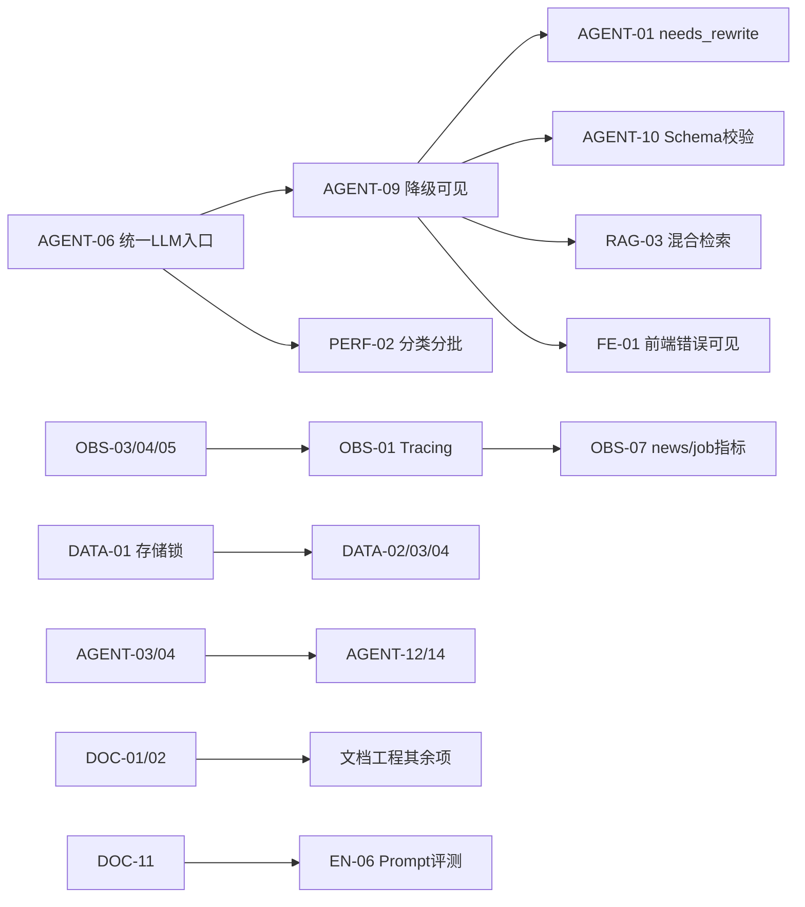

# 03 · 优先级路线图

> 评审日期：2026-09-08 ｜ 配套文档：`01-工程评审报告.md`、`02-文档工程优化方案.md`
> 本文回答三件事：**先做什么、按什么顺序做、做完怎么验证**。

---

## 1. 优先级模型

```
优先级 = f(影响面 × 发生概率 × 不可逆性,  修复成本,  是否阻塞后续)
```

- **P0（本周/两周内）**：会真实伤到用户/数据/钱，或阻塞其它所有改进
- **P1（本月内）**：明显影响质量、成本或可维护性
- **P2（本季度）**：体验与工程美学，可排期
- **P3（待定）**：记录但不承诺（如 PostgreSQL 迁移）

### 1.1 四象限

| | 低成本（≤2d） | 高成本（>2d） |
|---|---|---|
| **高收益** | **立即做**：SEC-01、SEC-03、AGENT-06、AGENT-05、RAG-01、OBS-03/04/05、DOC-01/02、DATA-02、SEC-04、SEC-05、AGENT-08、AGENT-02 | **排期做**：OBS-01、AGENT-09、AGENT-07、DATA-01、RAG-03、AGENT-10、FE-01、DOC-11 |
| **低收益** | **顺手做**：ARCH-03、ARCH-04、OBS-06、PERF-10、DOC-06（改文档部分）、FE-06 | **不做并记录理由**：DATA-06（PG 迁移，先记录）、MEM-01（L2 待决策）、EN-14（可观测平台化，先接轻量方案） |

---

## 2. 批次计划

### 批次 A · 本周（止血 + 让故障可见）

目标：**让系统"坏了能被人知道"**，并关掉确定性安全漏洞。

| 序 | 编号 | 事项 | 工作量 | 验收标准 |
|---|---|---|---|---|
| A1 | SEC-01 | chat 路由补会话归属校验 | 0.5d | A 用户带 B 的 conv_id 请求返回 404；新增集成测试 |
| A2 | SEC-03 | 重开限流（auth/upload/job/news-refresh 分组） | 1d | 压测登录接口触发 429；SSE 不受影响 |
| A3 | AGENT-06 | news/job/classifier/image 统一走 `ainvoke_with_stats` | 1d | 跑一次日报与一次职位分析，`total_cost_usd > 0` 且出现在 metrics |
| A4 | AGENT-05 | 修复 LLM 重试计数 | 0.5d | 注入 429 后 `llm_retry_count` 为真实值（1/2），不再只有 0/2 |
| A5 | OBS-03/04/05 | 指标标签与静默失败修复 | 1d | `user_id` 真实、tool 名真实、埋点异常可见 |
| A6 | RAG-01 | 入库闸门公式修正 + 阈值入 config | 1d | 低质对话样本入库率显著下降；`ingest_total{decision}` 有数据 |
| A7 | DOC-01/02 | 主 README + 导航补齐（news/job/share + 孤儿） | 1d | 新人按 README 能找到全部子系统；G-1 孤儿检测通过 |
| A8 | SEC-04 | 异常原文不再外泄 | 0.5d | 构造异常，响应只含 error_id |

**批次 A 合计 ≈ 6.5 人日**，完成后系统从"静默失败"变为"可观测失败"。

---

### 批次 B · 两周内（反思回路 + 数据正确性 + 文档骨架）

| 序 | 编号 | 事项 | 工作量 | 依赖 | 验收 |
|---|---|---|---|---|---|
| B1 | AGENT-09 | 降级可见化（state → 响应 → 指标 → UI） | 2d | A3 | 断网时响应 `degraded=true`、指标 +1、UI 有角标 |
| B2 | OBS-01 | Tracing 打通（collector 持有 + 中间件 trace_id） | 1d | A5 | 一次请求可见 5 个节点 span |
| B3 | AGENT-01 | 实现 `needs_rewrite` 分支 | 1d | B1 | 构造用例，确实发生重写 |
| B4 | AGENT-07 | PromptRegistry（路径配置化 + 版本 + 热重载） | 2d | — | 改 md 无需重启；缺失即 fail-fast |
| B5 | DATA-01 | 存储层锁（conversation/append/index） | 1.5d | — | 并发 50 条消息无丢失 |
| B6 | DATA-02/03/04 | news index 原子写 + job 缓存清理 + archive 按用户淘汰 | 2d | B5 | 无孤儿文件；缓存文件不再单调增长 |
| B7 | SEC-02 | JWT 强化（禁默认密钥、jti 黑名单、刷新限制） | 1.5d | — | 未设强密钥时拒绝启动；登出后 token 失效 |
| B8 | PERF-02 | news 分类分批改 | 1d | A3 | 300 条输入下分类成功率 >95%（指标可查） |
| B9 | DOC-11 | 新增 news/job 子系统文档 | 1.5d | — | 新人按文档能独立跑通一次日报/一次职位分析 |
| B10 | DOC-05/06 | 记录类边界 + 14 条冲突修复 | 1d | — | 冲突清单清零 |

**批次 B 合计 ≈ 14.5 人日**。

---

### 批次 C · 本月内（质量与能力台阶）

| 序 | 编号 | 事项 | 工作量 | 依赖 |
|---|---|---|---|---|
| C1 | AGENT-10 | LLM 输出 Pydantic 校验 | 2d | B1 |
| C2 | AGENT-03/04 | 反思策略接线（should_reflect）+ checkpointer/recursion_limit | 2.5d | B3 |
| C3 | AGENT-12/14 | 步骤并行调度 + 建议回灌 Planner | 2.5d | C2 |
| C4 | RAG-03 | Query Rewrite → BM25 混合 → Rerank（分三步落地） | 4d | B1 |
| C5 | RAG-08 | 黄金集扩到 30~50 条 + 答案正确性断言 | 2d | — |
| C6 | FE-01/02 | 前端错误可见 + SSE 重连/controller 治理 | 3d | B1 |
| C7 | PERF-01/03/04 | news 并发化 + 周月报复用法 + 采集限流 | 3.5d | B8 |
| C8 | OPS-01/02/03/04/05 | 灰度链路（修或下线）、恢复脚本、端口、告警 | 5d | — |
| C9 | OBS-07 | news/job 指标补齐 | 1.5d | A3 |
| C10 | DOC-03/04/07/08/12 | 部署手册合并、清单生成、元信息头、RAG FAQ 映射、CI 守卫 | 4d | A7 |
| C11 | SEC-06/07/08 | SSRF 加固、cookie 不回传、前端 401 路径 | 2.5d | — |

**批次 C 合计 ≈ 32 人日**（可按人月拆分并行，建议 2 人 3~4 周）。

---

### 批次 D · 本季度（架构演进与能力增强）

| 序 | 编号 | 事项 | 工作量 |
|---|---|---|---|
| D1 | EN-06 | Prompt 版本管理与 A/B 评测闭环 | 5d |
| D2 | EN-09 | 长任务异步化 + 任务中心（news/job） | 6d |
| D3 | EN-05/EN-10 | 用户反馈闭环 + 知识库治理面板 | 5d |
| D4 | RAG-04/02 | 分块策略升级 + 知识过期/版本/驱逐 | 5d |
| D5 | ARCH-01/02/05 | 编排层合并、DI 容器、超长函数拆分 | 6d |
| D6 | FE-03/04/07 | 类型治理 + 组件测试 + 代码分割 | 6d |
| D7 | EN-11 | PostgreSQL 迁移（含权限下推） | 8d+ |
| D8 | DOC-13/14 | API 文档自动化 + 目录物理重组 | 2d |

---

## 3. 依赖关系图（关键路径）



**关键路径**：`A3 → B1 → C1/C4/C6`（统一 LLM 入口 → 降级可见 → 质量/检索/前端三方向并行）。先做 A3 能同时解锁成本可见性与后续所有质量工作。

---

## 4. 度量：改进前后对照基线

建议在本轮启动时采集一次基线，3 个月后再采一次：

| 指标 | 当前（基线，静态推演） | 3 个月目标 | 数据来源 |
|---|---|---|---|
| 故障可见率（异常请求中能被监控捕获的比例） | ≈0%（全链路静默降级） | >90% | `sekb_agent_degraded_total` |
| 单次对话 LLM 成本可归因率 | 主干 100%，news/job 0% | 100% | `sekb_llm_cost_usd_total` |
| 知识库低质条目占比 | 未知（无指标） | <15% | `sekb_ingest_total{decision}` |
| 日报生成成功率 | 无指标 | >98% | 新增 `news_report_status_total` |
| 日报生成耗时 | 【推断】10~20 分钟 | <5 分钟 | 新增 `news_report_latency` |
| job 分析有效步骤率（7 步中非降级比例） | 无指标 | >95% | 新增 `job_step_status` |
| 文档孤儿数 | 8 | 0 | 守卫 G-1 |
| 文档-代码冲突数 | 14 | 0 | 本节清单 |
| CI 门禁中"非阻断"项数 | 2（mypy、eval） | 0 | `ci.yml` |
| 单元测试覆盖（后端） | 34 个测试文件，job 子系统 0 | job/ news 均有覆盖 | pytest |

---

## 5. 明确的"不做"清单（记录理由，避免反复讨论）

| 项 | 理由 |
|---|---|
| 立即迁移 PostgreSQL | 当前 JSON 存储在单用户/小规模下可用；先加锁与原子写（DATA-01）即可解 90% 风险，迁移成本应花在权限下推时一并做（EN-11） |
| 实现 L2 中期记忆 | 尚无明确用户需求；保留接口，先把它从"看起来已支持"的配置里移除以免误导（MEM-01） |
| 自建可观测平台（Langfuse/Phoenix） | 先把现有 Prometheus + 打通的 trace 用好（OBS-01/02），平台化是 D 阶段事项（EN-14） |
| 修复灰度发布链路 | 若当前不做灰度发布，建议**下线** `canary_monitor.sh` + `nginx-canary.conf` 并文档标注"未启用"，比修一套没人用的链路更划算（OPS-01） |
| 完整断点续传（D8） | 已有轻量方案；等存储层改造（D7）后顺带实现 |

---

## 6. 建议的每周节奏

1. **周一**：从批次 A→B→C 顺序取条目，确认无依赖阻塞后开工；
2. **每个 PR**：必须带"验收标准"对应的一条测试或一条指标（文档类 PR 带守卫脚本）；
3. **每周五**：更新 `docs/05-records/CHANGELOG.md` 与本文件的"当前进度"小节；
4. **每月末**：重跑一次 `sekb eval`，把 9 项指标与上月对比（这是"自迭代"是否真的在变好的唯一客观证据）。

---

## 7. 与既有需求的对应（对齐 `docs/BACKLOG.md`）

| BACKLOG 条目 | 本次评审关联编号 |
|---|---|
| 1 聊天功能增强（复制/多选/导出/分享） | FE-01（错误可见是其前置）、EN-01（溯源导出依赖引用能力） |
| 2 文件自动归类 + 系列文章识别 | `services/series.py` 正则误判风险（见 01 号 ARCH-07 与 series 分析）、RAG-04 |
| 3 Phase 2 招聘分析 Agent | AGENT-06/07/08、PERF-05、DATA-03/04/07、SEC-07、SEC-11、DOC-11 |
| D1 明文 PAT | SEC-09（加 gitleaks 防复发） |
| D3 RSSHub 自建运维 | OPS-06（纳入监控）、PERF-03 |
| D4 招聘真实职位采集 | SEC-11（合规评估先行） |
| D8 断点续传 | 见本文件 §5「不做」 |

> 建议：将 `docs/BACKLOG.md` 中的 D 类条目与本文编号建立双向链接，避免需求跟踪与评审结论两套台账（对应 DOC-05）。

---

## 8. 第二轮更新（2026-09-08 晚）—— 详见 `04-第二轮-增量功能与全量复核.md`

项目新增了用户画像、skill 技能调度、对话排队、分享分类限定、ChromaDB 加固等能力，本路线图**已增补如下调整**，原批次 A/B/C/D 依然有效：

| 调整 | 内容 | 工作量 |
|---|---|---|
| **新增批次 A0（立即，半天）** | R2-18 修复被打红的 `chat-store.test.ts` 断言 → R2-03 备份脚本加 `trap` → R2-01/02 分享越权与过期 → R2-05 队列卡死 → SEC-01 越权校验 | 0.5d |
| **批次 B'（新增，8 人日）** | R2-06 真流式（3d）、R2-12/13 画像存储锁与路径统一（1.5d）、R2-11 缓存失效（0.5d）、R2-15 同步 IO 与注入缓存（1d）、R2-04/19/20 脚本与存储（2d） | 8d |
| **优先级上调** | DOC-01（主 README 未同步任何新能力）、R2-06（真流式，同时是性能与体验的解锁项） | — |
| **复核结论** | 第一轮 12 项重点：修复 1（D10）、部分修复 3、未修复 8。**批次 A 尚未启动** | — |

健康度总分由 5.4 下调至 **5.0**（能力增加、敞口增加、工程化未同步）。
