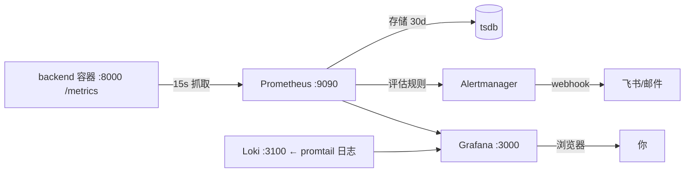

# 11 · Prometheus / Grafana 监控配置与使用手册

> **本文回答什么问题**：怎么看监控报表？Prometheus 与 Grafana 怎么配、怎么改？为什么有时候看不到数据？
> **适合谁读**：没接触过 Prometheus/Grafana 的维护者、需要自己改报表的人。
> **读完能做什么**：能登录 Grafana 看数据、会写基本 PromQL 查询、会按正确姿势修改/新建看板与告警规则、会排查「看不到数据」等问题。

> 技术口径（指标/告警清单、口径缺陷）见 `docs/tech/09-OBSERVABILITY.md`；本文是「操作 + 修改」手册。

> ⚠️ **监听地址（2026-09-16 起，务必先读）**
> 监控栈的对外端口由 `.env.prod` 的 `MONITOR_BIND_IP` 决定，**生产已设为 `100.71.24.105`（Tailscale）**：
> Prometheus `9091` / Grafana `3001` / Loki `3101` / Alertmanager `9093` 只监听该地址，
> **`127.0.0.1` 上没有任何进程监听** —— 所以：
> - 在服务器上执行 `curl http://localhost:9091/...` 会**连接被拒**；请用 `http://100.71.24.105:9091/...`
>   （本文所有示例已按此改写；若你改了 `MONITOR_BIND_IP`，请同步替换）。
> - 本机浏览器直接访问 `http://100.71.24.105:3001` 即可（需在 Tailscale 网络内），不再需要 SSH 端口转发；
>   仍想用隧道时，**目标侧必须写 Tailscale IP**：`ssh -L 3001:100.71.24.105:3001 bo@49.232.42.91`，
>   然后浏览器开 `http://localhost:3001`。
> - 背景：Docker 发布端口走 iptables **FORWARD** 链，`ufw`（INPUT 链）管不到，
>   原先公网不可达只靠腾讯云安全组 —— 绑到 Tailscale 后不再依赖它。
> - feishu-webhook `5001` 固定绑 `127.0.0.1`（只被 backend/Alertmanager 经内网调用）。
> - 自检：`sudo ss -ltnp | grep -E ':(9091|3001|3101|9093)\b'` 应只看到 `100.71.24.105`。

---

## 1. 架构速览与访问入口



| 组件 | 容器内地址 | 对外端口 | 访问方式 |
|------|-----------|---------|---------|
| Prometheus | :9090 | 9091（宿主） | 仅内网（Tailscale）：`http://<服务器Tailscale IP>:9091` |
| Grafana | :3000 | 3001（宿主） | 仅内网：`http://<服务器Tailscale IP>:3001` |
| Loki | :3100 | 3101（宿主） | 一般由 Grafana 代理，无需直连 |
| Alertmanager | :9093 | 9093 | 内网 UI，一般不直接访问 |

> ⚠️ **防火墙只放行 22/80/443/41641(Tailscale)**，Grafana/Prometheus **未对公网开放**。请通过 Tailscale 访问（配置见 `docs/ops/05-TAILSCALE-ACCESS.md`）。若确需公网，建议走 nginx 反代 + 鉴权，勿裸暴露端口。

### 1.1 登录 Grafana
- 地址：`http://<Tailscale IP>:3001`
- 账号：环境变量 `GRAFANA_ADMIN_USER`（默认 `admin`）、`GRAFANA_ADMIN_PASSWORD`（默认 `admin`，生产已改，见 `.env.prod`）。
- 容器内实际值：`docker exec sekb-grafana sh -c 'echo "$GF_SECURITY_ADMIN_USER"'`（密码同理）。
- 首次登录后建议改密码：Grafana 左下角头像 → Change password。

### 1.2 我应该看哪个页面？
| 想看什么 | 入口 |
|---------|------|
| 系统总览（QPS/错误率/延迟/成本/健康） | Grafana → Dashboards → **SEKB / SEKB 系统总览** |
| 原始指标查询 / 手工查数 | **Prometheus** → 顶部 "Table"/"Graph"（先试 `http://<IP>:9091`） |
| 某条请求的日志 | Grafana → Explore → 数据源选 **Loki** |

---

## 2. 看报表第一步：Grafana 总览看板

已自动 provisioned 一个看板：**SEKB 系统总览**（文件夹 SEKB），含 12 个面板：

| 面板 | PromQL（可自行改） |
|------|-------------------|
| 消息处理速率 QPS | `sum(rate(sekb_messages_total[5m]))` |
| 错误率 | `sum(rate(sekb_messages_total{status="error"}[5m])) / sum(rate(sekb_messages_total[5m]))` |
| 日累计成本 USD | `sekb_daily_cost_usd` |
| 服务健康状态 | `sekb_service_health` |
| 端到端延迟 P50/P95/P99 | `histogram_quantile(0.95, rate(sekb_e2e_latency_seconds_bucket[5m]))` |
| 消息按意图分布 | `sum by (intent)(increase(sekb_messages_total[1h]))` |
| LLM 调用次数（按模型） | `sum by (model)(rate(sekb_llm_calls_total[5m]))` |
| LLM Token（按方向） | `sum by (direction)(rate(sekb_llm_tokens_total[5m]))` |
| LLM 成本累计（按模型） | `sum by (model)(sekb_llm_cost_usd_total)` |
| 重试与降级事件 | `rate(sekb_llm_retries_total[5m])` / `rate(sekb_llm_degradations_total[5m])` |
| 知识入库状态 | `sum by (status)(increase(sekb_knowledge_ingest_total[1h]))` |
| 子系统健康 | `sekb_service_subsystem_health` |

**看板右上角**：时间范围（默认近 6h）、刷新（15s）、可全屏/分享。

### 2.1 为什么看不到数据？（最高频问题）

「有看板但没曲线/数字为 0」最常见 3 个原因：

1. **时间范围内确实没流量**：`rate(sekb_messages_total[5m])` 只在有聊天消息时才有值。没用户聊天 → QPS/错误率自然为空或 0。→ 先**去 Chat 页发一条消息**，几秒后再看。
2. **面板用了 `[5m]`/`[1h]` 速率区间，时间范围又太小**：切到 `now-24h` 或 `now-7d` 再看趋势。
3. **后端本身没上报该指标**：部分指标因埋点缺陷从未写入（见 `docs/tech/09-OBSERVABILITY.md` §2.3：`sekb_conversations_total`/`reflection_pass_rate`/`tool_call_latency`/`llm_call_latency` 定义但未写入——查不到是正常的）。

**验证数据真的在采集**（不依赖 Grafana）：
```bash
# 到服务器执行
curl -s "http://100.71.24.105:9091/api/v1/query" \
  --data-urlencode 'query=sum(rate(sekb_messages_total[24h]))'
# 期望返回 {"status":"success","data":{"result":[{"value":[时间戳,"7.00…"]}]}}
```

### 2.2 Prometheus Targets 页（排查抓取）
- 打开 Prometheus `http://<IP>:9091` → **Status → Targets**。
- 期望：`backend` / `prometheus` 两个 job 都 `UP`。
- 若 `backend` DOWN：后端未启动或 `/metrics` 不通。看：`curl http://localhost:8000/metrics | head`（服务器本机）。
- ⚠️ 旧版本曾有一个 `backend-health` job（抓 JSON health 端点），因 Prometheus 无法解析 JSON 而恒 DOWN——已于 2026-09 移除，健康探活改用 `up{job="backend"}` 告警与 `/metrics` 内 `sekb_service_health`。

---

## 3. PromQL 速查（够你自己查数）

| 想表达 | PromQL |
|--------|--------|
| 最近 5 分钟每秒处理消息数 | `sum(rate(sekb_messages_total[5m]))` |
| 最近 1 小时新增消息 | `sum(increase(sekb_messages_total[1h]))` |
| 错误率（比例） | `sum(rate(sekb_messages_total{status="error"}[5m])) / sum(rate(sekb_messages_total[5m]))` |
| 按意图分组 | `sum by (intent)(increase(sekb_messages_total[1h]))` |
| 总成本（当前值，累计） | `sekb_llm_cost_usd_total` |
| 单日成本 | `sekb_daily_cost_usd` |
| P95 端到端延迟 | `histogram_quantile(0.95, sum by (le)(rate(sekb_e2e_latency_seconds_bucket[5m])))` |
| 健康探针 | `up{job="backend"}`（1=在线） |
| 服务健康 | `sekb_service_health`（1=ok / 0=degraded） |
| LLM 降级次数/5m | `rate(sekb_llm_degradations_total[5m])` |

> 所有自定义指标以 `sekb_` 开头，完整 23 个指标清单见 `docs/tech/09-OBSERVABILITY.md` §2（含「哪些其实没写入」）。
> 常用函数：`rate()` 每秒速率、`increase()` 增量、`sum by (...)` 分组、`histogram_quantile()` 分位数、`max/min/avg over_time(...)`。

---


### 3.1 Prometheus 自带页面能做什么（不是报表平台）
Prometheus 网页（`http://<IP>:9091`）**不能建报表/看板**，它只提供：
- **Graph 页**：顶部输入一条 PromQL，点 Execute → 可画**单个表达式**的临时折线图（适合“查这条指标有没有数据”）。数据临时，不保存为看板。
- **Table 页**：同一表达式以表格形式返回当前值。
- **Status → Targets**：查看各抓取目标是否 UP（排查“没数据”首选）。
- **Status → Rules / Alerts**：查看告警规则加载情况与当前告警状态。
- **Status → Service Discovery / Command-Line Flags**：排障用。

要做**组合多图表的正式报表/看板**，一律到 Grafana（数据源已接好）：Dashboards → SEKB → SEKB 系统总览，或自行新增（见 §4）。

> 常用自查：先在 Prometheus Graph 页 `Execute` 一条指标（见 §3 PromQL 速查），确认有数后，再到 Grafana 看板里加/改对应面板。

## 4. 修改 / 新建报表的正确姿势（重要）

### 4.1 规则：改「provisioning JSON」，不要只靠 UI
- Grafana 通过 **文件 provisioning** 自动加载看板：`deploy/grafana/provisioning/dashboards/*.json`（`dashboards.yml` 每 30s 扫描，`allowUiUpdates: true`）。
- 你在 UI 里拖动/改面板，会临时生效，但**重启 Grafana 或 30s 后可能被 JSON 文件覆盖**——因为 compose 把该目录以只读挂载给 provisioning。
- ✅ **持久改法**：修改仓库里的 `deploy/grafana/provisioning/dashboards/*.json` → 重启 grafana（或等 30s 自动 reload）。
- 新建看板同理：复制一份 JSON 放到该目录 → 重启。

### 4.2 修改现有面板的 PromQL（示例：把错误率阈值改一下）
1. 打开看板 → 点面板标题 → **Edit**。
2. 右侧 Query 里改 PromQL 表达式 → Run query 预览。
3. 记下改动 → 到仓库改对应 JSON 里该面板的 `expr` → `docker compose -f docker-compose.monitoring.yml restart grafana`。
   > 简单改法也可：Edit → 面板标题右侧 "…" → 复制 JSON/导出 JSON → 贴回仓库文件并重启。

### 4.3 新增一个面板（改 JSON 为例）
1. 打开看板 JSON（`sekb-overview.json`）。
2. 在 `"panels": [...]` 里加一块（minimal 示例）：
```json
{
  "title": "LLM 降级次数",
  "type": "timeseries",
  "gridPos": { "h": 8, "w": 8, "x": 0, "y": 20 },
  "targets": [{ "expr": "rate(sekb_llm_degradations_total[5m])", "refId": "A" }]
}
```
3. 保存 → 重启 grafana → 看板自动出现该面板。
> 也可直接在 Grafana UI 里 Add panel 做好，再导 JSON 回仓库固化。

### 4.4 新增数据源（一般不需要——Prometheus/Loki 已配）
- 数据源配置：`deploy/grafana/provisioning/datasources/datasources.yml`（Prometheus→`http://prometheus:9090`，Loki→`http://loki:3100`）。改动后重启 grafana。
- UI 里加的数据源在重启/重扫后可能被 provisioning 覆盖，建议直接改该文件。

---

## 5. 配置文件地图与热加载

| 文件 | 作用 | 修改后如何生效 |
|------|------|--------------|
| `deploy/prometheus.yml` | 抓取目标/频率 | Prometheus 已开 `--web.enable-lifecycle`：`curl -X POST http://100.71.24.105:9091/-/reload` 或重启容器 |
| `deploy/alerts.yml` | 告警规则（12 条） | 同上 reload（规则变更立即重估） |
| `deploy/alertmanager.yml` | 告警路由/接收器 | 重启 alertmanager |
| `deploy/grafana/provisioning/datasources/datasources.yml` | Grafana 数据源 | 重启 grafana |
| `deploy/grafana/provisioning/dashboards/dashboards.yml` + `*.json` | 看板 provider 与看板内容 | 等 30s 自动 reload，或重启 grafana |
| `deploy/promtail-config.yml` / `deploy/loki-config.yml` | 日志采集 / Loki 保留期 | 重启 promtail / loki |
| `docker-compose.monitoring.yml` | 端口/镜像/资源/环境变量 | `docker compose -f docker-compose.monitoring.yml up -d` 重建 |

**常用运维命令（在服务器，仓库根目录执行）**：
```bash
# 查看监控容器
docker compose -f docker-compose.monitoring.yml ps
# 重启某个组件
docker compose -f docker-compose.monitoring.yml restart grafana
# 热加载 Prometheus 配置/规则（无需重启）
curl -X POST http://100.71.24.105:9091/-/reload
# 查看 Prometheus 是否加载了新规则
curl -s http://100.71.24.105:9091/api/v1/rules | python3 -m json.tool | head -30
# 查看告警状态
curl -s http://100.71.24.105:9091/api/v1/alerts | python3 -m json.tool | head -30
```

---

## 6. 告警怎么改

告警规则在 `deploy/alerts.yml`（12 条，6 组），Prometheus 每 15s 评估。
规则示例：
```yaml
groups:
  - name: service_availability
    rules:
      - alert: BackendDown
        expr: up{job="backend"} == 0
        for: 1m
        labels: { severity: critical }
        annotations:
          summary: "后端服务不可达"
```
- **改阈值/时长**：改 `expr` 或 `for` → reload Prometheus。
- **触发后发飞书/邮件**：路由与接收器在 `deploy/alertmanager.yml`（按 severity 分 critical/warning，飞书 webhook 到 `http://feishu-webhook:5001/webhook`）。
- 各告警含义/触发条件见 `docs/tech/09-OBSERVABILITY.md` §5；排障见 `docs/ops/07-ALERTING-TROUBLESHOOTING.md`。

---

## 7. 常见问题（FAQ）

| 现象 | 原因 | 解决 |
|------|------|------|
| 看板全空/数字 0 | 该时间段无流量，或指标本身未埋点 | §2.1 排查；先产生一条聊天消息 |
| Prometheus Targets 里 backend DOWN | 后端没起或 /metrics 不通 | `curl localhost:8000/metrics`；`docker compose ps` |
| 想改面板但重启被还原 | provisioning JSON 只读覆盖 UI | 改仓库 JSON 后重启（§4.1） |
| Grafana 登录不了 | 密码记错 | `docker exec sekb-grafana sh -c 'echo "$GF_SECURITY_ADMIN_PASSWORD"'` |
| 公网打不开 3001/9091 | 防火墙只放行 22/80/443 | 走 Tailscale；确需公网则 nginx 反代+鉴权 |
| 告警没收到飞书 | 路由/接收器/feishu 配置 | 见 `docs/ops/07-ALERTING-TROUBLESHOOTING.md` |
| 想查某次请求的 trace | Grafana Explore → Loki | 按 `trace_id` 过滤（日志字段已提取） |
| 指标保留多久 | Prometheus 30d / Loki 14d | 改 compose 的 retention 后重建 |

---


### 历史修复记录（2026-09-09）
- **看板报表空白根因修复**：provisioning 生成的 Prometheus/Loki 数据源 uid 是随机的，而 `sekb-overview.json` 面板固定引用 `uid: prometheus` → 面板查无数据源 → 报表空白。修复：在 `datasources.yml` 给两个数据源固定 `uid: prometheus` / `uid: loki`（先经 API 删除旧源再重建，避免 provisioning 与存量数据源冲突导致 grafana 启动失败——若直接改 uid 重启会报 `data source not found`）。
- **移除无效抓取**：旧版 prometheus.yml 含 `backend-health` job（抓 JSON 健康端点，Prometheus 无法解析恒 DOWN），已移除；健康看 `up{job="backend"}` 与 `sekb_service_health`。

> 改数据源 uid 的注意：若 grafana_data 卷里已有同名数据源，请先 `editable: true` 重启 → 用 Grafana API 删除旧源 → 再切回带固定 uid 的配置重启，避免 provisioning 冲突（见上）。

## 8. 术语速查

| 术语 | 含义 |
|------|------|
| Scrape | Prometheus 定时拉取目标指标的机制 |
| Target | 一个被采集的实例（job 下的 backend 等） |
| PromQL | Prometheus 查询语言 |
| Exporter / metrics 端点 | 应用暴露指标的 HTTP 路径（这里是 `/metrics`） |
| Histogram | 直方图指标（配合 `histogram_quantile` 算分位数） |
| Provisioning | Grafana 从文件自动配置数据源/看板 |
| Alertmanager | 负责把告警去重/分组/路由到通知渠道的组件 |
| Loki / promtail | 日志聚合 / 日志采集（docker 容器日志 → Loki） |

---

## 相关文档

- `docs/tech/09-OBSERVABILITY.md`：指标/告警技术口径、完整指标字典、决策树。
- `docs/ops/05-TAILSCALE-ACCESS.md`：Tailscale 访问监控页。
- `docs/ops/07-ALERTING-TROUBLESHOOTING.md`：告警排障。
- `docs/tech/00-README.md`：技术文档地图。
