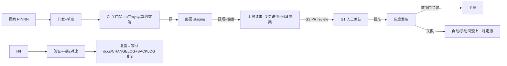

# 变更与发布操作规约（14-CHANGE-RELEASE-POLICY）

> 本文定义 SEKB 的**变更与发布操作规则**：谁能改什么、上线前要过哪些确认、如何留痕、事故如何回滚。依据《自迭代闭环设计 RFC》（docs/tmp/），Human-In-Loop（HIL）为强制原则。
> 适用于：代码发布、配置变更、数据操作、凭据轮换、依赖升级、回滚。

---

## 1. 总则（安全第一）

1. **生产写操作默认人工确认**：任何写入/影响线上运行/数据的操作，默认需人批准；例外须先在本规约列明。
2. **提案可追溯**：每次生产变更关联一个「提案号」（如 P-YYYYMMDD-NNN），贯穿 代码→测试→发布→审计。
3. **先 staging 后 prod**：非紧急变更必须先上 staging 验证；紧急热修也须有最小验证。
4. **可回滚**：每次发布带「回滚预案」，回滚目标为上一稳定版本。
5. **全程留痕**：操作日志记 谁/何时/做了什么/依据哪个提案/结果。

---

## 2. 变更类型与风险分级

| 级别 | 类型 | 示例 | 前置要求 |
|------|------|------|---------|
| L0 低危 | 文档、注释、非逻辑代码 | docs 更新、日志措辞 | 单测绿即可 |
| L1 常规 | 功能/修复（无 schema/配置破坏） | BugFix、新增端点 | staging 冒烟 + 单测 + 人工确认发布 |
| L2 高危 | 影响数据/结构/并发/安全 | 存储迁移、删除逻辑、鉴权改动、DB/Chroma 变更 | staging 全量验证 + 备份 + 双人确认（推荐） |
| L3 紧急 | 线上事故热修 | 宕机、数据损坏、安全漏洞 | 最小验证 + 即时人工批准 + 事后补全流程 |

**对应闸门**（来自 RFC G1-G6）：

| 闸门 | 适用级别 | 内容 |
|------|---------|------|
| G1 | L1+ | 生产部署前人工确认 |
| G2 | L1+（灰度） | 灰度放量比例/全量切换确认 |
| G3 | L1+ | 代码变更进生产前 PR review 确认 |
| G4 | L2/L3 | 数据/凭据/破坏性操作确认（永不自动） |
| G5 | L1+ | 自动回滚阈值/白名单人工批准（回滚触发可自动） |
| G6 | L2 | 降级/熔断/预算策略变更确认 |

---

## 3. 发布流程（标准）



**每步验收**：
- 单测：`scripts/incremental_test.sh` 绿；
- staging 冒烟：健康端点 + 核心链路（见 ops 各部署手册）；
- 发布前：`scripts/backup_kb.sh` 备份已触发（L1+ 必做，L0 可选）。

---

## 4. 紧急热修流程（L3）

1. 先评估：是否真紧急（影响面/是否可等待常规流程）；
2. 最小修复 + 定向单测；
3. **即时人工批准**（电话/IM），事后 24h 内补齐 PR review 与文档；
4. 发布后紧盯指标（错误率/延迟/成本），异常立即回滚。

---

## 5. 回滚规约

| 项 | 规则 |
|----|------|
| 回滚目标 | 上一稳定版本（镜像 tag 或 git commit），而非"最新修复" |
| 触发 | L1+ 发布后健康门禁失败 → 自动回滚（阈值人先批）；其余回滚人工 |
| 回滚操作 | 还原镜像 tag → 重启 → 健康验证；数据类回滚走备份恢复（人工） |
| 记录 | 每次回滚写审计与复盘 |

---

## 6. 数据与凭据操作规约

1. **数据删除/迁移/清库**：L2，需备份 + 人工确认 + 双人（推荐）；
2. **凭据轮换**（JWT_SECRET/API key/域名证书）：L2，计划内执行，先发公告避免误伤在线会话；
3. **只读诊断**（agent/脚本）：不持有生产写凭据；
4. 生产环境变量：仅存服务器 secret 目录（权限 600）/docker secret，**不入 git**。

---

## 7. 审计记录格式

每次生产变更在 `docs/CHANGELOG.md` 与（如启用）审计日志中记录：

```text
[P-YYYYMMDD-NNN] <变更摘要>
  级别: L1
  范围: backend/app/api/routes/chat.py
  执行人: <owner>
  确认闸门: G1/G3 (时间戳/方式)
  发布: 灰度→全量 (时间戳) / 回滚 (时间戳+原因)
  验证: 健康OK / 指标OK
  关联: BACKLOG#xxx / codeReview#xxx
```

---

## 8. 例外清单（可自动化项，须先批准）

| 动作 | 级别 | 可否自动 | 前提 |
|------|------|---------|------|
| 文档/非逻辑改动合并 | L0 | 可（经 doc-sync 检查） | — |
| staging 部署与冒烟 | L1 | 可 | 门禁绿 |
| 自动回滚到上一稳定版 | L1 | 可（触发自动） | G5 阈值已批 |
| 生产部署/灰度/全量 | L1+ | 否 | G1/G2/G3 |
| 数据/凭据/破坏性操作 | L2+ | 否 | G4 |

---

## 9. 与既有机制的关系

- 增量测试：`scripts/incremental_test.sh`（每提交前）
- 全量回归：`scripts/full_test.sh`（双周/月）
- 文档联动：pre-commit doc-sync + `check-freshness.sh`
- 监控/告警：docs/tech/09-OBSERVABILITY + docs/ops/07-ALERTING
- 待办：docs/BACKLOG.md（提案落点）

---

## 相关文档

- [docs/ops/00-README.md](./00-README.md)
- [docs/tmp/自迭代闭环设计RFC.md](../tmp/自迭代闭环设计RFC.md)
- [docs/tech/09-OBSERVABILITY.md](../tech/09-OBSERVABILITY.md)
