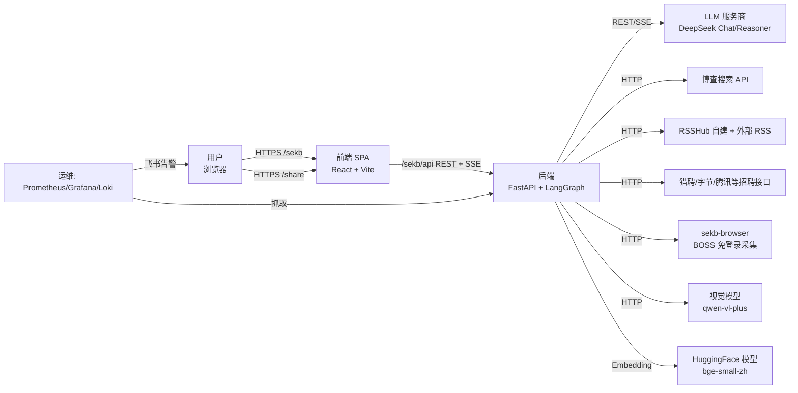
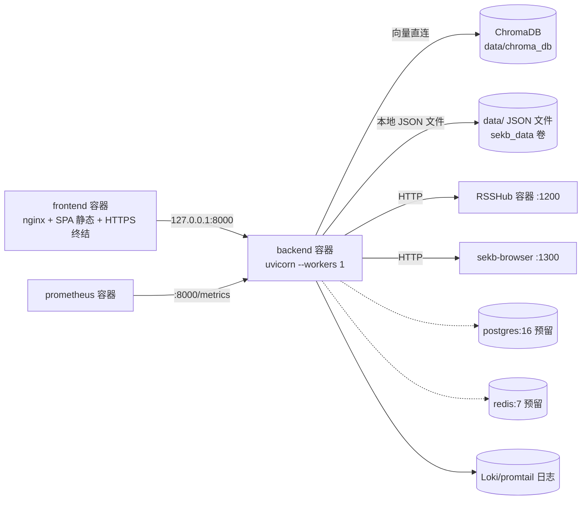
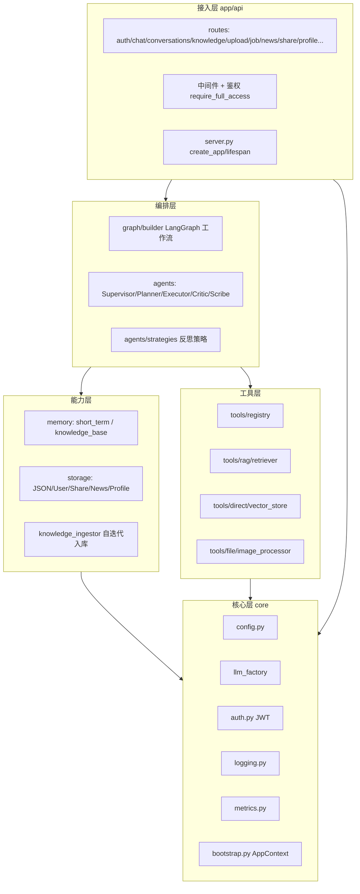
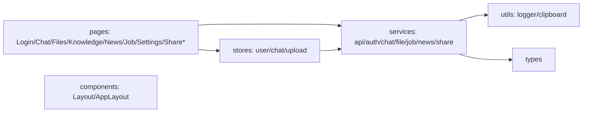

# 01 · 系统架构总览（ARCHITECTURE）

> **本文回答什么问题**：SEKB 这个系统整体长什么样？为什么这么选型？关键取舍是什么？
> **适合谁读**：决策者、架构师、新成员（作为全景入口）。
> **读完能做什么**：理解系统上下文/容器/组件三层结构、技术选型理由、关键架构决策（ADR）与质量属性取舍；知道去哪篇文档深入。

---

## 1. 系统上下文（C4-L1）

SEKB 是**自迭代个人知识库 Agent**：一个面向个人的「知识库 + 多 Agent 助手」，可上传资料自动入库、对话时 RAG 增强，并附带资讯日报与职位分析两个子域。

**外部 Actor 说明**：

| Actor | 关系 | 证据 |
|-------|------|------|
| 用户（浏览器） | 通过 nginx 访问 `/sekb/` SPA；`/share/*` 无登录访问 | docker-compose.prod.yml:103-145；frontend/src/App.tsx:26-52 |
| LLM 服务商（DeepSeek） | 唯一主 LLM；`deepseek-chat` 快思考 / `deepseek-reasoner` 慢思考 | backend/config.yaml:18-24, 26-69 |
| 博查搜索 API | `web_search` 工具，联网增强 | backend/config.yaml:203-209 |
| RSSHub + 15 个 RSS 源 | 资讯日报采集 | backend/config.yaml:306-325 |
| 视觉模型（qwen-vl-plus） | 图片分析（**不经 llm_factory**） | backend/app/tools/image_processor.py:306-337 |
| 招聘公开接口 / sekb-browser | 职位采集 | backend/app/agents/job/fetcher.py（详见 05/事实表 T5） |
| 监控栈 | Prometheus/Grafana/Loki/Alertmanager + 飞书 webhook | docker-compose.monitoring.yml:26-190 |

---

## 2. 容器视图（C4-L2）

生产以 Docker Compose 部署于**单台云服务器**（见 `docs/ops/`），核心容器：

| 容器 | 镜像 | 端口/对外 | 职责 | 证据 |
|------|------|-----------|------|------|
| backend | self-evolving-kb-backend | 127.0.0.1:8000（仅内网） | FastAPI + LangGraph 全部逻辑；`--workers 1` | docker-compose.prod.yml:37-101；backend/Dockerfile |
| frontend | self-evolving-kb-frontend | 80/443 对外（nginx + HTTPS） | SPA 静态托管 + 反代 `/sekb/api` → backend；SSE 关缓冲 | docker-compose.prod.yml:103-145；deploy/nginx.conf |
| rsshub | diygod/rsshub | 1200（内网） | 资讯 RSS 源（含掘金鸿蒙标签等） | docker-compose.prod.yml:147-169 |
| browser | sekb-browser | 1300（内网） | BOSS 直聘采集（浏览器自动化） | docker-compose.prod.yml:171-197 |
| postgres/redis | postgres:16/redis:7 | 内网 | **预留未启用**（配置注释说明 Phase 后切换） | docker-compose.prod.yml:199-244 |
| prometheus/grafana/loki/alertmanager | prom/grafana/loki 等 | 内网/监控 | 指标、看板、日志、告警 | docker-compose.monitoring.yml:26-190 |

> **关键约束**：backend `--workers 1` + 绑定 `127.0.0.1`，是并发/安全设计的地基（多进程会与 ChromaDB/SQLite 单写冲突，见 ADR-03 / 09 文档）。

---

## 3. 组件视图（C4-L3）与分层职责

### 3.1 后端分层

**依赖注入与装配**：`AppContext` dataclass 聚合全部运行时组件，由 `initialize_app("config.yaml")` 一次性装配（bootstrap.py:52-95, 97-267）；`get_app_context()` 提供全局访问（bootstrap.py:270-274），API 路由通过它取组件。

**装配顺序**（bootstrap.py:124-246）：配置 → JWT 强度校验（fail-fast）→ 日志 → tracing → LLM 工厂 → JSON 存储 → L1 记忆 → 工具注册表（起 MCP 子进程）→ 反思策略 → L3 ChromaDB（条件）→ 知识入库引擎（条件）→ 用户/分享存储 → LangGraph 图 → news/job Agent（条件）。

### 3.2 前端分层

前端要点：React 18 + Vite + TS；路由 `App.tsx` 划分登录/注册/分享(无需登录)/主布局（受保护）；SSE 聊天由 `stores/chat.ts` 消费（逐会话隔离，见 03 前端节）。

---

## 4. 技术选型表

| 组件 | 选型 | 版本约束 | 选型理由（证据） | 替代方案 | 权衡 |
|------|------|---------|-----------------|---------|------|
| Web 框架 | FastAPI | ≥0.115 | 异步原生 + OpenAPI 自动生成；uvicorn ASGI | Django/Flask | 生态/中间件少于 Django |
| Agent 引擎 | LangGraph | ≥1.0,<2.0 | 原生状态图/循环/条件路由，支撑 PDCA 多 Agent | AutoGen/CrewAI/手写 | 学习曲线；升级 API 变动 |
| LLM 客户端 | langchain-deepseek + langchain-openai 兜底 | ≥1.0,<2.0 | DeepSeek 主力 + OpenAI 兼容降级 | 原生 SDK | 框架抽象偶有损耗 |
| LLM 模型 | deepseek-chat / deepseek-reasoner | — | 快/慢思考分级；9 角色 | 其它闭源/开源 | reasoner 慢（TTFT 高，见 02） |
| 向量库 | ChromaDB | 1.5.9（锁版） | 本地持久化简单、user 隔离 | Qdrant/Pgvector | 已知 HNSW bloat 段损坏 bug（D11/09） |
| Embedding | BAAI/bge-small-zh-v1.5 | — | 中文效果好、512 维 | 其它 | 需联网拉模型（HF_HOME 缓存卷） |
| 会话/消息存储 | 本地 JSON 文件 | — | 单用户起步最简单；asyncio.Lock+原子写 | SQLite/Postgres | 并发/查询弱（见 11 EVOLUTION） |
| 鉴权 | JWT（自研签发） | — | 轻量；90 天过期滑动续租 | OAuth 托管 | 无 refresh 黑名单（见 BACKLOG） |
| 前端 | React 18 + Vite 5 + TS | — | 生态成熟；TS 强类型 | Vue/Next | 打包体量偏大 |
| 前端 UI | Ant Design 5 | — | 组件齐全 | MUI | 定制重需 CSS 覆盖 |
| 状态管理 | Zustand 4 | — | 轻量 hook 化 | Redux | 需纪律约束结构 |
| 日志 | structlog（JSON） | ≥24.1 | 结构化，含 trace_id/用户上下文 | logging 标准 | 学习成本 |
| 指标 | Prometheus client | — | 与监控栈配套 | — | 埋点不全（见 T8/11） |
| 重试 | tenacity | ≥8.2 | 指数退避统一管理 | 手写 | 流式调用未纳入（见 T3） |

---

## 5. 关键架构决策（ADR）

> 每条 ADR 含：背景 → 决策 → 理由 → 后果 → 替代方案。完整证据见对应 .facts 表与代码。

### ADR-01：为什么用 LangGraph 而不是手写 ReAct / Plan-and-Execute
- **背景**：需要 PDCA 循环（意图识别→规划→执行→反思→沉淀），含循环重规划与条件路由。
- **决策**：用 LangGraph `StateGraph`，节点=Supervisor/Planner/Executor/Critic/Scribe，显式边与条件路由（backend/app/graph/builder.py:288-362）。
- **理由**：状态图让「重规划循环」（critic → planner，最多 2 次）成为显式结构而非手写控制流；`stream_mode`/`astream_events` 支持思考过程流式（02 详述）。
- **后果**：依赖 langgraph 版本 API；需学习 TypedDict 状态。
- **替代**：手写编排（可控但难维护循环与并发流）；CrewAI（约束多于 LangGraph）。

### ADR-02：为什么 JSON 文件存储而不是一开始就上关系库
- **背景**：个人级起步，需会话/消息/用户等持久化。
- **决策**：JSONStorage（`data/index.json` + `data/conversations/{id}.json`），`asyncio.Lock` + `tmp/os.replace` 原子写（json_storage.py:343-460）；compose 中 postgres:16 **预留未启用**（docker-compose.prod.yml:199-221）。
- **理由**：部署零依赖；单用户量级足够；`--workers 1` 规避跨进程竞态。
- **后果**：无 SQL 查询/索引/事务回滚；随多用户演进必须迁移（见 11 EVOLUTION + 04 DATA-MODEL）。
- **替代**：SQLite（更好并发但需重构 storage 抽象）、Postgres（运维重）。

### ADR-03：为什么 uvicorn 固定 `--workers 1` + 绑定内网
- **背景**：曾 `--workers 2` 引发 ChromaDB/SQLite 并发写、指标失真、scheduler 重复执行（审查 CON-01/03/OPS-01）。
- **决策**：`CMD --workers 1`（backend/Dockerfile），端口绑 `127.0.0.1:8000:8000`（docker-compose.prod.yml:52-55）。
- **理由**：ChromaDB/SQLite 均单进程写模型；单 worker 是当前数据层一致性兜底。
- **后果**：单点吞吐受限；后续多 worker 须先外置存储 + Chroma client-server（BACKLOG 已记录）。
- **替代**：Redis 分布式锁 + Chroma client-server + SQLite→Postgres（演进路线，11）。

### ADR-04：为什么向量检索「进程内直连」而非统一走 MCP
- **背景**：检索是延迟敏感路径；MCP 序列化/进程通信有 ~40ms 开销。
- **决策**：`DirectVectorStore` 直连 ChromaDB（tools/direct/vector_store.py:30-90）；MCP 仅用于 `web_search` 等外部工具（registry.py:99-195）。
- **理由**：本地调用 <10ms；工具层内外分治（本地直连高频、MCP 对外）。
- **后果**：知识库与 registry 两套抽象并存，需维护两处实现。
- **替代**：全量 MCP（统一但慢）、全量直连（外部工具 SSRF/凭据边界风险）。

### ADR-05：为什么混合模型分级（chat/reasoner）且按角色固定
- **背景**：不同任务思考深度不同；reasoner 贵且慢。
- **决策**：`deepseek-chat` 用于 supervisor/executor/scribe 等快角色；`deepseek-reasoner` 用于 planner 与复杂 critic（config.yaml:26-69）；`cost_control` 做预算与 reasoner 占比告警。
- **理由**：质量/成本/延迟三角；planning 的 CoT 收益高。
- **后果**：planner 是首 token 延迟主因（15s+，见 02 TTFT 分析）。
- **替代**：全 chat（快但规划弱）/ 全 reasoner（贵且慢）。

### ADR-06：同步/异步边界划在哪
- **背景**：知识入库、偏好抽取等不应阻塞主回复。
- **决策**：主对话全异步（FastAPI + LangGraph 流式）；知识自迭代入库、后台偏好抽取用 `asyncio.create_task` 后台执行（chat.py:591, 393-404 等；T7 详述）。
- **理由**：用户感知延迟优先；失败不阻断主链路（降级为 disabled/error 日志）。
- **后果**：后台任务需幂等/补偿设计（部分缺失，见 T7/T11）。
- **替代**：消息队列（重，当前无此规模）。

### ADR-07：为什么模块化单体而非微服务
- **背景**：单人多域（聊天/RAG/资讯/职位），规模小但模块多。
- **决策**：一个 backend 镜像内按 `app/` 子域分层（api/graph/agents/memory/storage/tools/core/...），AppContext 装配。
- **理由**：部署简单、共享 AppContext 与 LLM 工厂、延迟低。
- **后果**：模块间易耦合；靠目录纪律维持边界（见 07 DESIGN-PATTERNS 评分）。
- **替代**：微服务（运维成本远超收益）/ 插件式。

### ADR-08：为什么白名单做「完整/预览」两级访问而非完整 RBAC
- **背景**：个人知识库开放给少数协作者；需控制越权读。
- **决策**：`ALLOWED_EMAILS` 环境变量 → 白名单=完整功能，否则=preview（仅功能说明+资讯只读）；`require_full_access` 路由级依赖 + 前端菜单收窄（app/core/access.py；auth `/me` 返回 access_level）。
- **理由**：两级足够覆盖当前协作场景，实现简单。
- **后果**：无细粒度权限；多人共享需逐域扩展（BACKLOG）。
- **替代**：完整 RBAC/workspace（演进路线，11）。

---

## 6. 质量属性与取舍

| 属性 | 目标/现状 | 实现手段 | 取舍/现状缺口 |
|------|-----------|---------|--------------|
| 性能（TTFT） | 复杂查询首字 27-35s；简单 5-8s | 流式生成；异步；`--workers 1` | reasoner planner 主导延迟（ADR-05）；RAG 21s 曾现（T7/02） |
| 可用性 | 重试 + 降级 | tenacity（非流式）；reasoner→chat 降级；异常脱敏返回 error_id | 流式无重试；静默降级点偏多（见 07） |
| 可扩展性 | 模块化单体 | AppContext 装配；分层 | `--workers 1` 单点；JSON 存储不可多进程（ADR-03） |
| 安全性 | 越权与暴露面收敛 | JWT + 白名单两级；端口绑内网；nginx HTTPS；JWT 强度启动校验 | 无 refresh 黑名单；分享过期依赖默认 30 天（BACKLOG） |
| 成本 | token 预算控制 | cost_control：单对话/日预算、reasoner 占比告警、降级链 | 已接入 13/23 调用点，10 处绕过统计（T3） |
| 可维护性 | 文档-代码联动 | 本工程 docs/tech + pre-commit 联动 + 活文档 | 仍在收敛中（本重构） |
| 可观测性 | 指标/日志/告警 | Prometheus 指标、structlog JSON、Loki/Grafana、飞书告警 | trace 依赖 LangSmith（本地未落）；埋点覆盖不全（T8/11） |

---

## 7. 模块导航（对应文档）

| 领域 | 深入阅读 |
|------|---------|
| 主对话链路、思考流式、TTFT | 02-RUNTIME-FLOWS.md |
| 各子模块职责/接口/陷阱 | 03-MODULES.md |
| 数据实体与隔离 | 04-DATA-MODEL.md |
| REST/SSE/CLI 全部接口 | 05-API-REFERENCE.md |
| config.yaml 全字段与死配置 | 06-CONFIG-REFERENCE.md |
| 设计评价与技术债 | 07-DESIGN-PATTERNS.md、11-EVOLUTION.md |
| 指标/日志/告警/排障 | 09-OBSERVABILITY.md |
| 术语 | 08-GLOSSARY.md |

---

## 8. 已知缺口与待确认项

- based-on-commit 已置 9ab01fa（本工程首版 commit），各篇完成后回填最终值。
- 视觉模型（qwen-vl-plus）绕过 llm_factory（T3），架构文档按现状记录；是否统一由 11 决策。
- postgres/redis 容器为预留，本文按「现状未启用」描述（docker-compose 中定义但配置未启用）。

---

## 相关文档

- [00-README.md](./00-README.md)
- [02-RUNTIME-FLOWS.md](./02-RUNTIME-FLOWS.md)
- [03-MODULES.md](./03-MODULES.md)
- [08-GLOSSARY.md](./08-GLOSSARY.md)
