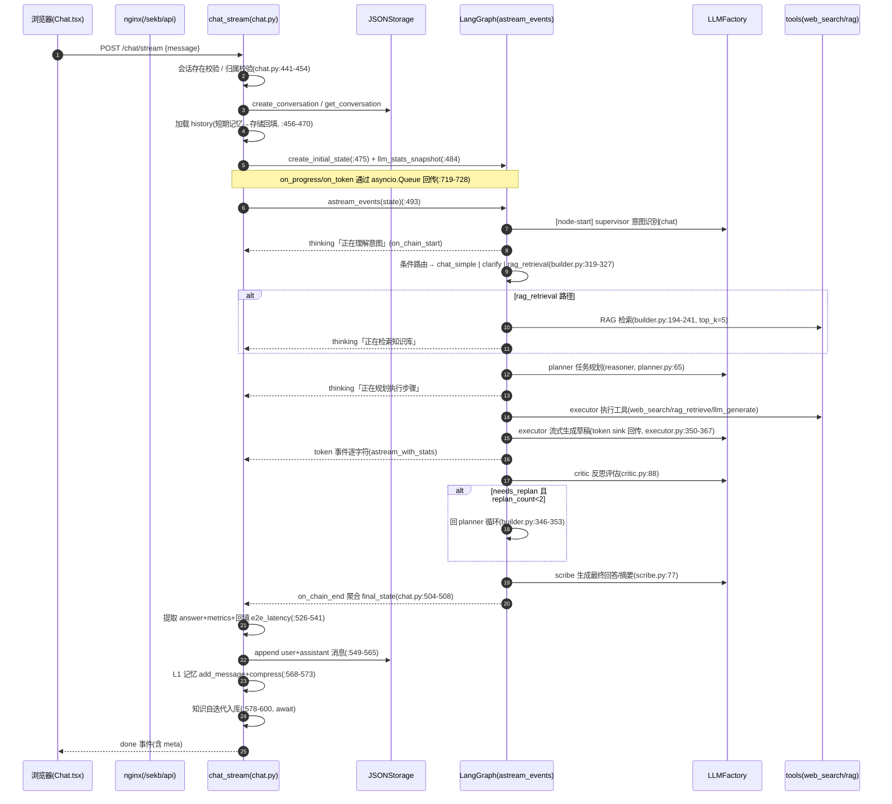
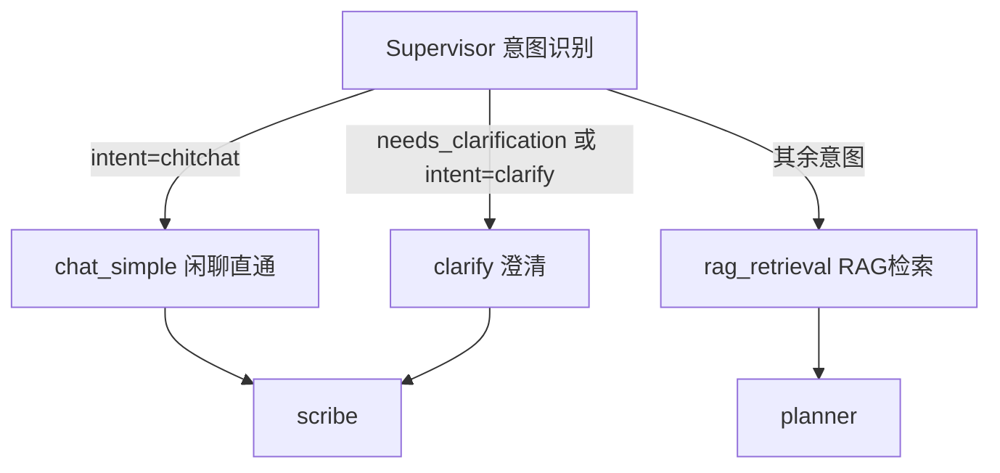
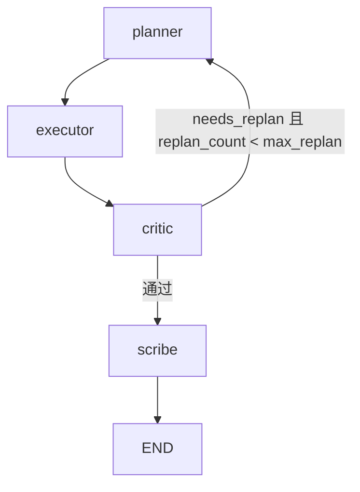
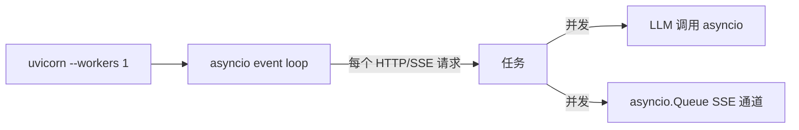

# 02 · 运行时流程（RUNTIME-FLOWS）

> **本文回答什么问题**：一次用户请求在系统里如何流动？状态如何流转？哪里慢、哪里会失败、如何降级？
> **适合谁读**：后端开发者、新成员（对照跑通请求）。
> **读完能做什么**：能对着时序图定位每一步的代码位置、超时/重试/降级策略，能分析 TTFT 与失败路径。

---

## 1. 主对话链路时序（含每个 LLM/工具调用点）



**步骤代码位置与耗时热点**：

| 步骤 | 代码 | 典型耗时 | 说明 |
|------|------|---------|------|
| 会话校验/历史加载 | chat.py:441-470 | <50ms | JSON 读盘；首进会话需回填 L1 |
| supervisor 意图 | supervisor.py（LLM） | ~1.4s | deepseek-chat；JSON 输出 |
| RAG 检索 | builder.py:194-241 | 75ms（正常）/曾 21s | 本地 ChromaDB 直连；冷启动加载 embedding 模型慢 |
| planner 规划 | planner.py:65 | **15-35s** | deepseek-reasoner；TTFT 主因（ADR-05） |
| executor 执行+草稿 | executor.py:219-257, 350-367 | 5-11s | 流式生成即答案；先跑工具再生成 |
| critic 反思 | critic.py:88 | 1.8-3s | 简单走 chat，复杂走 reasoner |
| scribe | scribe.py:77 | 1.4-3s | 摘要+指标 |

---

## 2. SSE 流式协议时序（思考 + 答案）


**SSE 事件类型**：`thinking`（节点开始即推送，含"正在理解意图/检索/规划/执行/反思/生成"）；`token`（答案逐 token）；`done`（含 meta：conversation_id/intent/metrics/trace_id/latency_ms）；`error`（detail）。帧格式 `data: {json}\n\n`（chat.py:736-737）。前端按 `\n\n` 分帧解析（services/chat.ts:77-103）。

---

## 3. 状态机与路由条件

### 3.1 意图路由（Supervisor 后，builder.py:319-327）



### 3.2 反思路由（Critic 后，builder.py:346-353）



- **路由决策函数**：`route_after_supervisor`（builder.py:63-80）、`route_after_critic`（builder.py:83-…）；反思策略 always/adaptive/sampling（agents/strategies/，config `reflection.policy`，config.yaml:124-133）。
- **重规划上限**：`reflection.max_replan: 2`（config.yaml:126）→ 至多 3 轮 planning 后强制直通 scribe（critic 侧依据 T4 状态摘要）。
- **IntentType**：chitchat / kb_strict / kb_prefer / web_default / task_plan / clarify（state.py:27-34）。

### 3.3 GraphState 生命周期

- 创建：`create_initial_state`（state.py:192-242），含 user_input/conversation_id/trace_id/user_id/history。
- 流转：见 01 组件图；关键字段写入/读取矩阵见 `.facts/T4-agent-state.md`。
- 销毁：进程内 GraphState 在请求结束即释放（无持久化）；会话历史持久化到 JSON 存储，L1 短期记忆纯内存（重启丢失）。

---

## 4. 并发模型



| 维度 | 现状 | 证据 |
|------|------|------|
| 进程 | 单 worker（uvicorn --workers 1） | backend/Dockerfile:136-139；docker-compose.prod.yml |
| 会话并发 | `_conv_inflight` 集合，同 `user\|conv` 只允许一个流式（新会话键退化为 `user\|`，见 T1 异常） | chat.py:700-708, 823-825 |
| 前端 | 流式按会话隔离（stores/chat.ts `streamingByConv`），两会话可并行 | frontend/src/stores/chat.ts |
| 后台任务 | `asyncio.create_task`（偏好抽取、图运行任务） | chat.py:393-404, 740-742 |
| 数据一致性 | asyncio.Lock + tmp/os.replace 原子写（JSONStorage 内） | json_storage.py |

> **约束**：单 worker 下所有「并发」都是协程级；阻塞式 CPU/同步 IO（如 PaddleOCR、trafilatura 抓取）会占事件循环，news 采集内部用 Semaphore(10) 限并发（T7）。多 worker 需先外置存储（ADR-03）。

---

## 5. 长任务与异步路径

| 任务 | 触发 | 是否阻塞主请求 | 幂等 | 证据 |
|------|------|--------------|------|------|
| 知识自迭代入库 | 主对话内 `await ingest`（注释称不阻塞，实际同步 await） | **是**（实现与注释漂移） | 冲突检测 coexist | chat.py:578-600；T7 D-T7-4 |
| 后台偏好抽取 | skill=应聘助手 时 `asyncio.create_task` | 否 | 无 | chat.py:393-404（skill 已从前端移除，入口存留） |
| 上传后台入库 | Starlette BackgroundTasks | 否（响应先回，/status 轮询） | 覆盖上传可重复 | upload.py:561-578 |
| 资讯定时调度 | APScheduler cron（日报/周报/月报） | 否（同进程） | 日报 skip+文件锁；周/月报无 | scheduler.py:34-54；T7 |
| client-event 上报 | 前端 5s flush | 否 | 非幂等 | monitoring.py |

---

## 6. 错误传播与降级路径

```mermaid
flowchart TD
    R[异常发生] -->|SEKBError| H1[server.py exception_handler SEKBError]
    R -->|HTTPException| H2[返回指定状态]
    R -->|其它 Exception| H3[exception_handler Exception→500 + error_id]
    H1 -->|LLMError| M[映射 429/5xx/4xx]
    H3 --> O[脱敏返回 internal error_id(不泄露细节)]
    R -->|图内节点异常| F[astream_events except→降级回复 state.py:498-519]
    R -->|LLM 降级| D[reasoner→chat fallback(LLMFactory)]
```

| 层 | 处理方式 | 证据 |
|----|---------|------|
| API 层 | `SEKBError`→统一 status；未知异常→`error_id` 脱敏 | server.py:75-…, 205-240 |
| 图层 | `_run_chat` except → 返回「抱歉…」降级 final_state | chat.py:498-519 |
| LLM | reasoner→chat 一级降级；chat 不可用抛错 | llm_factory.py:511-527 |
| 工具 | web_search MCP 失败→进程内直连降级；工具异常→executor 兜底 | registry.py:99-195；executor.py:375-381 |
| 知识入库 | 失败记 warning，不影响主回复返回 | chat.py:597-600 |

---

## 7. 超时与重试链路

| 环节 | 超时 | 重试 | 证据 |
|------|------|------|------|
| LLM 单次（非流式） | 60s | tenacity 2 次退避 1-10s（至多 3 次尝试） | config.yaml:22-24；llm_factory.py:270-283 |
| LLM 流式 | 无重试（失败由调用方兜底） | — | llm_factory.py:366-406 |
| web_search | 10s | 2 次指数退避 | T5；registry.py |
| RAG 检索 | 无显式（本地直连） | — | retriever.py |
| SSE 连接 | nginx read/send 300s | 前端无自动重连（T1/T9 记录） | deploy/nginx.conf；T1 异常 |
| 图片分析 | 30s | 无 | T5（image_processor） |

---

## 8. 首字节 / TTFT 路径分析（实测）

| 场景 | 首 token 时间 | 原因分解 | 说明 |
|------|--------------|---------|------|
| 简单问题（如"什么是向量库"） | **5-8s** | supervisor 1s + RAG 0.1s + 短 planner 或直通 | 实测节点进度 0s 理解→1s 检索→3s 执行→6s 反思→7s 生成 |
| 复杂/长链问题 | **27-35s** | supervisor 1.4s + RAG + **reasoner planner 15-35s** + executor 起 | 首字主因是 reasoner 规划（ADR-05），RAG 冷启动可致 21s |

**TTFT 各环节可优化点**（仅记录现状事实，建议归 11）：
- planner 用 deepseek-reasoner 是首字延迟主因（T3 实测 planner 15.5s/35s）。
- 思考过程现已「节点开始即推送」（on_chain_start），长节点期间用户可见"正在规划…"而非空白（chat.py:490-508）。
- 答案 token 流式自 executor 生成起即回传（token sink），无需等 scribe。

---

## 9. 已知缺口与待确认项

- 知识入库注释「不阻塞」与实际同步 await 不符（漂移，已在 T7 记录）。
- `_conv_inflight` 新会话锁键退化（`user|`），同用户两个新会话互斥串行（T1 异常）。
- SSE 前端无自动重连/断线续传。
- skill（应聘助手）入口已从前端移除，但后端偏好抽取分支存留（待清理，见 BACKLOG）。

---

## 相关文档

- [01-ARCHITECTURE.md](./01-ARCHITECTURE.md)（分层/部署）
- [03-MODULES.md](./03-MODULES.md)（各模块实现）
- [05-API-REFERENCE.md](./05-API-REFERENCE.md)（SSE 协议全规格）
- [08-GLOSSARY.md](./08-GLOSSARY.md)
- 事实表：[.facts/T4-agent-state.md](./.facts/T4-agent-state.md)、[.facts/T7-async-schedule.md](./.facts/T7-async-schedule.md)
