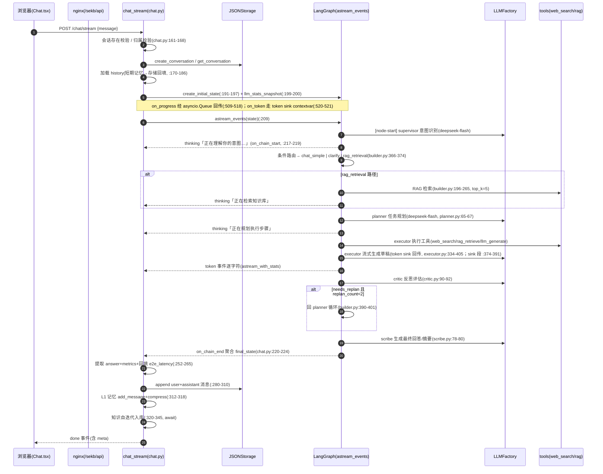
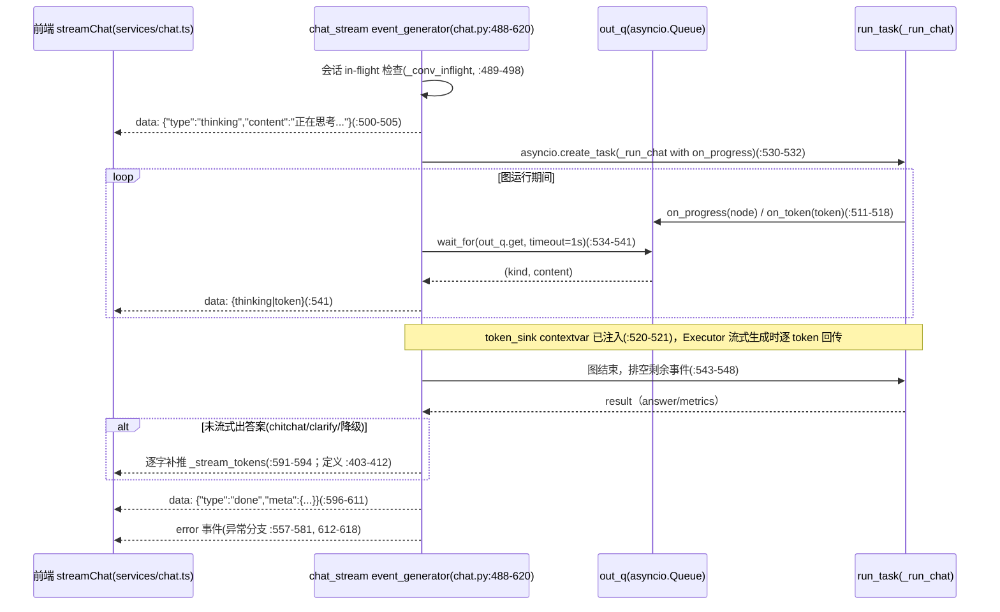
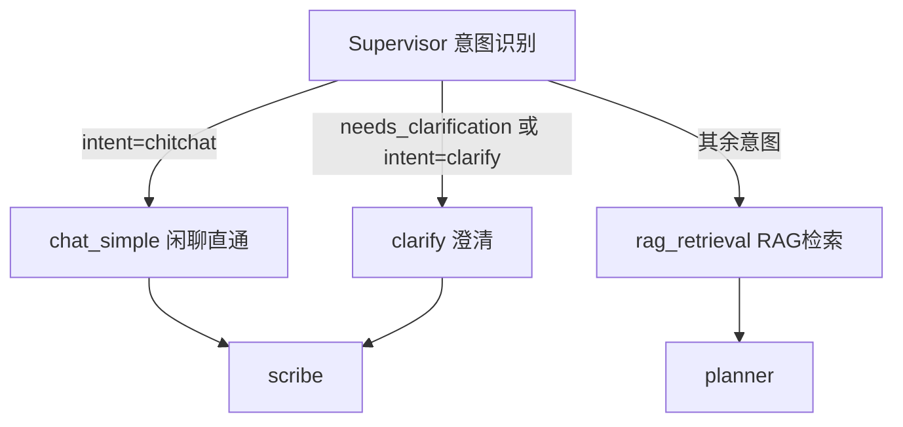
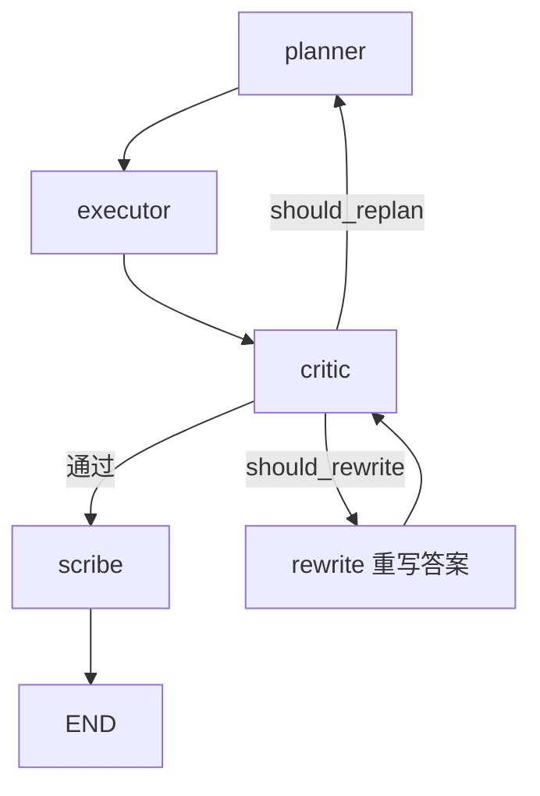
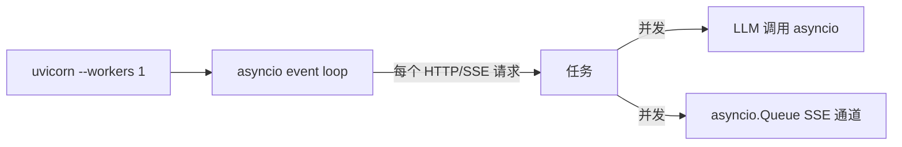

# 02 · 运行时流程（RUNTIME-FLOWS）

> **本文回答什么问题**：一次用户请求在系统里如何流动？状态如何流转？哪里慢、哪里会失败、如何降级？
> **适合谁读**：后端开发者、新成员（对照跑通请求）。
> **读完能做什么**：能对着时序图定位每一步的代码位置、超时/重试/降级策略，能分析 TTFT 与失败路径。

---

## 1. 主对话链路时序（含每个 LLM/工具调用点）



**步骤代码位置与耗时热点**：

| 步骤 | 代码 | 典型耗时 | 说明 |
|------|------|---------|------|
| 会话校验/历史加载 | chat.py:161-186 | <50ms | JSON 读盘；首进会话需回填 L1 |
| supervisor 意图 | supervisor.py（LLM） | ~1.4s | deepseek-flash（config.yaml:30-33）；JSON 输出 |
| RAG 检索 | builder.py:196-265 | 75ms（正常）/曾 21s | 本地 ChromaDB 直连；top_k=5（config.yaml:129）；冷启动加载 embedding 模型慢 |
| planner 规划 | planner.py:65-67 | 15-35s（reasoner 时期实测） | 现模型 deepseek-flash（config.yaml:33-37，7852aae 起全角色统一）；TTFT 主因（ADR-05） |
| executor 执行+草稿 | executor.py:89-141, 334-391 | 5-11s | 流式生成即答案；先跑工具再生成 |
| critic 反思 | critic.py:90-92 | 1.8-3s | 按 task_complexity 选 critic / critic_complex 角色（两者现均 deepseek-flash，config.yaml:44-54） |
| scribe | scribe.py:78-80 | 1.4-3s | 摘要+指标 |

---

## 2. SSE 流式协议时序（思考 + 答案）



**SSE 事件类型**：`thinking`（节点开始即推送，含"正在理解你的意图…/正在检索知识库…/正在规划执行步骤…/正在执行与调用工具…/正在反思与校验…/正在生成最终回答…"，文案见 `_NODE_PROGRESS` chat.py:59-68）；`token`（答案逐 token）；`done`（含 meta：conversation_id/title/intent/intent_confidence/metrics/trace_id/latency_ms/ingest_status/ingest_reason/degraded）；`error`（detail）。帧格式 `data: {json}\n\n`（chat.py:525-527）。前端按 `\n\n` 分帧解析（services/chat.ts:103-129）。

---

## 3. 状态机与路由条件

### 3.1 意图路由（Supervisor 后，builder.py:366-374）



### 3.2 反思路由（Critic 后，builder.py:390-401）



- **路由决策函数**：`route_after_supervisor`（builder.py:63-80）、`route_after_critic`（builder.py:83-99）；反思策略仅实现 always（agents/strategies/always.py；config `reflection.policy`，config.yaml:149-153 —— adaptive/sampling 占位已按 D3 删除）。
- **重规划上限**：`reflection.max_replan: 2`（config.yaml:151）→ 至多 3 轮 planning 后强制直通 scribe（critic 侧依据 T4 状态摘要）。
- **重写上限**：`reflection.max_rewrite: 1`（config.yaml:152）；`should_replan`/`should_rewrite` 由 Critic 依 `result_str` + 计数上限给出（critic.py:122-132）。
- **IntentType**：chitchat / kb_strict / kb_prefer / web_default / task_plan / clarify（state.py:26-33）。

### 3.3 GraphState 生命周期

- 创建：`create_initial_state`（state.py:194-244），含 user_input/conversation_id/trace_id/user_id/history。
- 流转：见 01 组件图；关键字段写入/读取矩阵见 `.facts/T4-agent-state.md`。
- 销毁：进程内 GraphState 在请求结束即释放（无持久化）；会话历史持久化到 JSON 存储，L1 短期记忆纯内存（重启丢失）。

---

## 4. 并发模型



| 维度 | 现状 | 证据 |
|------|------|------|
| 进程 | 单 worker（uvicorn --workers 1） | backend/Dockerfile:165-178（`--workers 1` 在 :175）；docker-compose.prod.yml 未覆盖 |
| 会话并发 | `_conv_inflight` 集合，同 `user\|conv` 只允许一个流式（新会话键退化为 `user\|`，见 T1 异常） | chat.py:489-498, 619-620 |
| 前端 | 流式按会话隔离（stores/chat.ts `streamingByConv`），两会话可并行 | frontend/src/stores/chat.ts:17, 82-96 |
| 后台任务 | `asyncio.create_task`（仅图运行任务；SSE 路径把 `_run_chat` 交给 asyncio 任务，客户端断开时显式 cancel） | chat.py:530-532, 549-553 |
| 数据一致性 | asyncio.Lock + tmp/os.replace 原子写（JSONStorage 内） | storage/json_storage.py:77, 139, 189 |

> **约束**：单 worker 下所有「并发」都是协程级；阻塞式 CPU/同步 IO（如 PaddleOCR、trafilatura 抓取）会占事件循环，news 采集内部用 Semaphore(10) 限并发（T7）。多 worker 需先外置存储（ADR-03）。

---

## 5. 长任务与异步路径

| 任务 | 触发 | 是否阻塞主请求 | 幂等 | 证据 |
|------|------|--------------|------|------|
| 知识自迭代入库 | 主对话内 `await ingest`（注释称不阻塞，实际同步 await） | **是**（实现与注释漂移） | 冲突检测 coexist | chat.py:320-345；T7 D-T7-4 |
| 求职偏好回流 | 内联 `await extract_and_update_profile`（`<PREF>` 标签，方案 A） | **是**（内联 await 在 `_run_chat` 内；无 `<PREF>` 时纯正则即返回、不调 LLM，开销≈0） | 无 | chat.py:260；profile_service.py:75-87；**方案 B（后台抽取）已随 skill 删除而失去触发点，当前无调用方**（`schedule_preference_extraction` 仍用 asyncio.create_task，profile_service.py:153-164） |
| 上传后台入库 | Starlette BackgroundTasks（仅 `async_process=true` 时） | 否（响应先回，/status 轮询） | 覆盖上传可重复 | upload.py:214-231 |
| 资讯定时调度 | APScheduler cron（日报/周报/月报） | 否（同进程） | 日报 skip+文件锁；周/月报无 | scheduler.py:107-136；service.py:56-94；T7 |
| client-event 上报 | 前端 5s flush | 否 | 非幂等 | monitoring.py:50-100；logger.ts:83 |

---

## 6. 错误传播与降级路径

```mermaid
flowchart TD
    R[异常发生] -->|SEKBError| H1[server.py exception_handler SEKBError]
    R -->|HTTPException| H2[返回指定状态]
    R -->|其它 Exception| H3[exception_handler Exception→500 + error_id]
    H1 -->|LLMError| M[映射 429/5xx/4xx]
    H3 --> O[脱敏返回 internal error_id(不泄露细节)]
    R -->|图内节点异常| F[astream_events except→降级回复 chat.py:225-246]
    R -->|LLM 降级| D[reasoner→chat fallback(LLMFactory；当前配置下不可达，见下表)]
```

| 层 | 处理方式 | 证据 |
|----|---------|------|
| API 层 | `SEKBError`→统一 status；未知异常→`error_id` 脱敏 | server.py:75-110, 222-291 |
| 图层 | `_run_chat` except → 返回「抱歉…」降级 final_state | chat.py:225-246 |
| LLM | ~~reasoner→chat 一级降级~~ **当前不可达**：全角色模型均为 deepseek-flash，`_should_fallback` 仅在模型名含 "reasoner" 时走降级、`_get_fallback_config` 亦只处理含 "reasoner" 的模型，故建实例失败直接抛 `LLMError` | llm_factory.py:193-207, 513-530 |
| 工具 | web_search MCP 失败→进程内直连降级；工具异常→executor 兜底 | registry.py:99-193；executor.py:122-151, 399-405 |
| 知识入库 | 失败记 warning，不影响主回复返回 | chat.py:342-345 |

---

## 7. 超时与重试链路

| 环节 | 超时 | 重试 | 证据 |
|------|------|------|------|
| LLM 单次（非流式） | 60s | tenacity 2 次退避（指数 1→10s，`stop_after_attempt(max_retries+1)` 即至多 3 次尝试） | config.yaml:24-26；llm_factory.py:272-285 |
| LLM 流式 | 无重试（失败由调用方兜底） | — | llm_factory.py:368-423 |
| web_search | 10s | 2 次指数退避（`2**attempt`） | config.yaml:226-227；bocha_server.py:188 |
| RAG 检索 | 无显式（本地直连） | — | retriever.py |
| SSE 连接 | nginx read/send 300s（`/sekb/api/` location） | 前端无自动重连（T1/T9 记录） | deploy/nginx.conf:221-237；T1 异常 |
| 图片分析 | 30s | 无 | image_processor.py:312 |

---

## 8. 首字节 / TTFT 路径分析（实测）

| 场景 | 首 token 时间 | 原因分解 | 说明 |
|------|--------------|---------|------|
| 简单问题（如"什么是向量库"） | **5-8s** | supervisor 1s + RAG 0.1s + 短 planner 或直通 | 实测节点进度 0s 理解→1s 检索→3s 执行→6s 反思→7s 生成 |
| 复杂/长链问题 | **27-35s**（⚠️ reasoner 时期实测，待重测） | supervisor 1.4s + RAG + **planner 15-35s** + executor 起 | 首字主因是 planner 规划（ADR-05），RAG 冷启动可致 21s。**当前全角色为 `deepseek-flash`**（`config.yaml:30-81`），耗时口径待重测 |

> ⚠️ 本表耗时为 reasoner 时期实测；`7852aae` 起全角色模型统一为 deepseek-flash（config.yaml:30-81），耗时待重测。

**TTFT 各环节可优化点**（仅记录现状事实，建议归 11）：
- planner 仍是最慢节点，但"用 deepseek-reasoner"已不成立：现配置为 deepseek-flash（config.yaml:33-37）；T3 实测的 planner 15.5s/35s 属 reasoner 时期数据，需在 flash 下重测。
- 思考过程现已「节点开始即推送」（on_chain_start），长节点期间用户可见"正在规划…"而非空白（chat.py:209-219）。
- 答案 token 流式自 executor 生成起即回传（token sink），无需等 scribe。

---

## 9. 已知缺口与待确认项

- 知识入库注释「不阻塞」与实际同步 await 不符（漂移，已在 T7 记录）。
- `_conv_inflight` 新会话锁键退化（`user|`），同用户两个新会话互斥串行（T1 异常）。
- SSE 前端无自动重连/断线续传。
- skill（应聘助手/资讯助手）模式已**彻底移除**：前端技能按钮（`c9d948a`）与后端分支（`daa76bd`）都不在了；
  随之失去触发点的是「方案 B 后台偏好抽取」（`profile_service.record_preferences_task`，无调用方），
  保留待「求职意图识别」落地后重新接上（见 `11-EVOLUTION`）。

---

## 相关文档

- [01-ARCHITECTURE.md](./01-ARCHITECTURE.md)（分层/部署）
- [03-MODULES.md](./03-MODULES.md)（各模块实现）
- [05-API-REFERENCE.md](./05-API-REFERENCE.md)（SSE 协议全规格）
- [08-GLOSSARY.md](./08-GLOSSARY.md)
- 事实表：[.facts/T4-agent-state.md](./.facts/T4-agent-state.md)、[.facts/T7-async-schedule.md](./.facts/T7-async-schedule.md)
