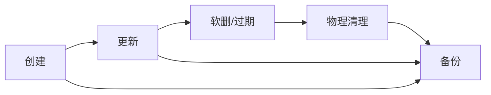

# 04 · 数据模型（DATA-MODEL）

> **本文回答什么问题**：数据存在哪、长什么样、如何隔离与备份？
> **适合谁读**：后端开发者、DBA、运维。
> **读完能做什么**：定位任意数据文件的 schema/读写方；理解隔离与生命周期；评估迁移风险。

> 数据源：事实表 [.facts/T6-storage.md](./.facts/T6-storage.md)（带 file:line 的完整证据），本文为提炼与结构化。

---

## 1. 数据根目录与生产挂载

```mermaid
flowchart TB
    subgraph Vol[sekb_data 卷 → /app/data]
        CD[chroma_db/]
        CONV[conversations/{conv_id}.json]
        IDX[index.json]
        NEWS[news/]
        PROF[profile/{user_id}.json]
        JR[job_reports/ + 缓存]
        US[users.json + shares/]
        UP[uploads/]
        HF[hf_cache/]
    end
    subgraph Vol2[sekb_browser_data]
        BR[browser cookie/登录态]
    end
```

- **生产根**：容器 `/app/data` ← 卷 `sekb_data`（docker-compose.prod.yml:89）；后端 WORKDIR `/app`（backend/Dockerfile:34）。
- **模型缓存**：`hf_cache/`（HF_HOME，docker-compose.prod.yml:78）。
- **浏览器服务**：独立卷 `sekb_browser_data`（cookie/登录态，docker-compose.prod.yml:201）。
- **备份**：`scripts/backup_kb.sh` 停 backend → 打包整卷 → 重启 → 保留 14 天（backup_kb.sh:65-128,147-156）。
- **并发前提**：`--workers 1` 单写进程（backend/Dockerfile:166,175；无此前提多进程共享 ChromaDB/SQLite 会损坏）。

---

## 2. 实体关系图

```mermaid
erDiagram
    USER ||--o{ CONVERSATION : "拥有"
    USER ||--o{ KNOWLEDGE_ENTRY : "拥有(user_id 过滤)"
    USER ||--o{ PROFILE : "一对一"
    USER ||--o{ JOB_REPORT : "拥有"
    CONVERSATION ||--o{ MESSAGE : "含"
    SHARE }o--|| USER : "创建"
    SHARE ||--o{ KNOWLEDGE_ENTRY : "限定分类范围读"
    CHAT_SHARE ||--|| CONVERSATION : "快照"
    NEWS_REPORT ||--o{ NEWS_ITEM : "含(sections)"

    USER { string id }
    CONVERSATION { string conv_id }
    MESSAGE { string msg_id, role, content }
    KNOWLEDGE_ENTRY { string entry_id, string user_id, vector embedding }
    PROFILE { string user_id }
    JOB_REPORT { string id }
    NEWS_REPORT { date date }
```

> 说明：User 存储在 `users.json`；Conversation/Message 在 JSONStorage；知识条目在 ChromaDB（vector 实体，metadata 关联 user）；News 为全局共享（无 user 隔离）。

---

## 3. ChromaDB 长期知识库

### 3.1 集合信息
| 项 | 值 | 证据 |
|----|----|------|
| 路径 | `data/chroma_db`（PersistentClient） | config.yaml:234；knowledge_base.py:147 |
| 集合 | `knowledge`，cosine 空间 | knowledge_base.py:116,148-151 |
| 向量维度 | 512（bge-small-zh）；hash 降级 256（仅 allow_hash_fallback=true 时） | embedding.py:47-118 |
| 相似度 | `1 - cosine_distance` | knowledge_base.py:317 |

### 3.2 条目字段（KnowledgeEntry）
| 字段 | 类型 | 默认 | 含义 |
|------|------|------|------|
| entry_id | uuid4 str | auto | 主键 |
| content | str | — | 内容 |
| source | conversation/document/manual | conversation | 来源类型 |
| source_id | str | "" | 原文件/会话标识 |
| user_id | str | "default" | 隔离维度 |
| topic | str | "" | 主题标签（可选） |
| importance_score | float | 0.5 | 重要度 |
| version / supersedes | int / str | 1 / None | 版本管理 |
| category_l1/l2/l3 | str | 其他/待分类/未分类 | 三级分类 |
| category_confidence | float | 0.0 | 分类置信度 |
| category_source | auto/manual | auto | 分类来源 |
| series | str | "" | 系列标识 |
| created_at/updated_at/last_accessed_at/access_count | str/str/str/int | now/now/now/0 | 生命周期 |
| metadata | 17 个标量字段落库 | — | to_chroma_metadata() |

**完整证据**：字段定义 knowledge_entry.py:58-78；to_chroma_metadata() knowledge_entry.py:80-105；隔离 where 过滤 knowledge_base.py:72-101,284-289。

### 3.3 检索与写入
- 检索：`retrieve(query, user_id, top_k=5, min_score=0.3, category_l1/2/3)`（knowledge_base.py:250-335）。
- 写入方：KnowledgeIngester 对话入库（knowledge_ingestor.py:325,400,433；由 chat.py:325 `ingest_conversation` 触发）、上传（upload.py:217,235 → upload_service.process_and_ingest）、批量删除/重分类（upload.py:356 删除、531/592 重分类）。
- 读取方：RAG 节点（builder.py:196-271）、knowledge 路由、分享链路。
- 清理：**无自动清理**；eviction 参数（max_items/stale_days/similarity_merge_threshold，config.yaml:143-146）为死配置【推断·待验证】。

---

## 4. JSONStorage（会话/消息）

### 4.1 布局与 schema
- `data/index.json`：全部会话元信息（ConversationMeta）单文件。
- `data/conversations/{conv_id}.json`：每会话消息数组。

| schema | 字段 | 说明 |
|--------|------|------|
| ConversationMeta | conv_id, user_id, title, status(active/archived/deleted), pinned, created_at, updated_at, message_count, total_input_tokens/output_tokens, total_cost_usd | base.py:34-51 |
| MessageRecord | msg_id, conv_id, role(user/assistant/system), content, intent?, tokens_input/output, latency_ms, trace_id?, created_at | base.py:54-70 |

### 4.2 写入/读取
- 写入：chat 路由（chat.py:286,310,352）、conversations 路由（conversations.py:122,299）。
- 读取：conversations.py:103,153,182,280；chat 历史 chat.py:174。
- 隔离：list 按 user_id 过滤 + status!=deleted（json_storage.py:283-287）。

### 4.3 原子性与删除
- `asyncio.Lock`（进程内）+ 临时文件 `os.replace` 原子写（json_storage.py:77,122-141,172-191,237-…）。
- 删除：软删（status=deleted）+ 物理删消息文件（json_storage.py:318-341）；索引记录不 purge。
- 局限：锁为单进程协程锁；无自动清理/压缩。

---

## 5. 其它持久化存储

### 5.1 L1 短期记忆（内存）
- 纯内存 dict：`_messages/_summaries/_conv_users`（short_term.py:80-84）；滑动窗口 max_turns×2；超 max_tokens 用 LLM 压缩为摘要（≤3 条，超限合并）。
- **无持久化**，重启即失；生产者 graph 各节点，压缩角色 scribe。

### 5.2 Profile 画像
- `data/profile/{user_id}.json`：UserProfile（user_id/bio/skills/career_goal/job_preferences/news_interests/updated_at，models/profile.py:35-44）。
- 写：chat 偏好回流（chat.py:260 `extract_and_update_profile`）、profile 路由（profile.py:51）；临时文件+os.replace，**无锁 RMW**（并发丢更新）。

### 5.3 News 存储
- `data/news/daily_{date}.md/.json` + `weekly_/monthly_{期}.md` + `index.json`（storage.py:29-39,71-78,101-133）。
- 报告结构：report={headline, sections[], comprehensive, total_count}（storage.py:181-243）。
- 保留 70 天（storage.py:23，config.yaml:330）；`_cleanup` **同时删 `daily_*.md` 与 `daily_*.json`**（storage.py:135-151），index 过期项仍残留。生成侧 `.lock_daily` 跨进程文件锁（service.py:68-69,96-105）。

### 5.4 Job 存档与缓存
- 报告：`data/job_reports/{rid}.md/.json` + index.json（索引截 200 条；批量报告按「用户+关键词+城市」去重并**物理删除**旧 .md/.json，archive.py:21,175-182,217-220）。
- 缓存：`job_analysis_cache.json`（14 天 TTL，key 含用户画像指纹，analysis_cache.py:17,20-33）、`job_cache.json`（14 天 TTL，单 key ≤1000 条，**全局 ≤200 个 key 按 ts 淘汰**，job_cache.py:22-24,111-114）。
- 均无锁 RMW；caches 已改原子写（analysis_cache.py:45-50；job_cache.py:83-88），archive 的 `_save_index` 仍为非原子整文件写（archive.py:132-134）。

### 5.5 用户与分享
- `data/users.json`：用户（含 password_hash、settings、is_active；`access_level` 是 `UserPublic` 派生字段而非落库，user.py:39）。写入为临时文件+os.replace 原子写（user_storage.py:32-37）。
- `data/shares.json` + `data/shares/{share_id}/{viewer}.json`：知识分享（默认 **7 天**过期，share.py:70-72；`<=0` 永不过期，share_storage.py:65-89。注意存储层形参默认仍为 30，share_storage.py:72，实际由路由传入 7）。
- 分享记录含访问审计 `view_count` / `last_accessed_at`（share.py:47-48），访问时由 `record_view` 累加（share_storage.py:117-125），列表接口已暴露（share.py:235-236）。
- `data/chat_shares.json`：对话分享（消息快照只读，chat_share_storage.py:31）。

### 5.6 上传
- `data/uploads/documents/{user_id}/`、`data/uploads/images/{user_id}/`；`data/uploaded_md5.json`（去重索引，实为 SHA-256 摘要，upload_service.py:39,42,45,82,88）。

---

## 6. 隔离与权限边界

| 存储 | 隔离维度 | 机制 | 越权风险点 |
|------|---------|------|-----------|
| ChromaDB | user_id | metadata where 过滤 | `user_id=None` 跨用户读（管理用）；分享按 share 限定分类 |
| JSONStorage | user_id | list 过滤 + 会话归属校验（chat.py:162-169） | 历史遗留 default 用户 |
| Profile | user_id 文件 | 文件级 | — |
| Job | user_id | 读写校验（archive.py:302-309,332-341） | — |
| News | 全局共享 | 无 | 只读接口鉴权（preview 可读） |
| 上传 | user_id 目录 | 目录级 | — |

**访问控制模型**：JWT 登录（90 天滑动）+ ALLOWED_EMAILS 白名单两级（full/preview）。preview 用户仅功能说明 + 资讯只读，不能触发重生成日报。

---

## 7. 数据生命周期与备份



| 存储 | 创建 | 更新 | 清理 | 备份 |
|------|------|------|------|------|
| ChromaDB | add | update/update_metadata | 无自动清理（死配置） | sekb_data 整卷 |
| JSONStorage | create_conversation | append/update | 软删不 purge | 整卷 |
| News | save_daily/periodic | 覆盖 | 70 天（md+json 同删，index 残留） | 整卷 |
| Job | save_report | 覆盖 | 索引截 200；批量报告去重删旧 .md/.json | 整卷 |
| Profile | upsert | upsert_update | 无 | 整卷 |
| 上传 | 落盘 | 覆盖 | 无自动 | 整卷（含原图/原始文件 L1 兜底） |

- 备份脚本：`scripts/backup_kb.sh`（停服→tar 整卷→重启→14 天轮转，backup_kb.sh:27,65-128,147-156）。
- **L1 兜底**：uploads/documents 原始文件保留，ChromaDB 全毁时可用 `scripts/rebuild_chroma_vectors.py` 重灌。

---

## 8. 迁移路径（to-be 摘要）

- JSONStorage → Postgres/SQLite：需改造 storage 抽象（compose 已预留 postgres:16）。
- L1 短期记忆 → Redis：仍为纯内存；**L2 中期记忆已启用 Redis**（config.yaml:120-125；装配 bootstrap.py:199-209，实现 session_memory.py），L1 尚未迁移。
- 数据一致性：多 worker 前必须先迁移（ADR-03 / 11-EVOLUTION）。

---

## 9. 已知缺口与待确认项

- ChromaDB eviction 配置为死配置（config.yaml:143-146），长期无自动淘汰。
- News 已随保留期同删 `daily_*.md/.json`（storage.py:135-151），仅 index 过期项残留；Job 索引 `_save_index` 按全局截 200（注释写「每用户」，archive.py:21,184），被截掉者物理文件残留、批量报告才去重删除。
- 多存储无锁 RMW（profile/shares/caches），依赖单 worker。
- `users.json` 已改原子写（user_storage.py:32-37）；残留缺口为 `uploaded_md5.json`（upload_service.py:76）与 job 报告索引（archive.py:134）仍是非原子整文件写。

---

## 相关文档

- [01-ARCHITECTURE.md](./01-ARCHITECTURE.md)
- [02-RUNTIME-FLOWS.md](./02-RUNTIME-FLOWS.md)
- [06-CONFIG-REFERENCE.md](./06-CONFIG-REFERENCE.md)
- [11-EVOLUTION.md](./11-EVOLUTION.md)
- 事实表：[.facts/T6-storage.md](./.facts/T6-storage.md)
