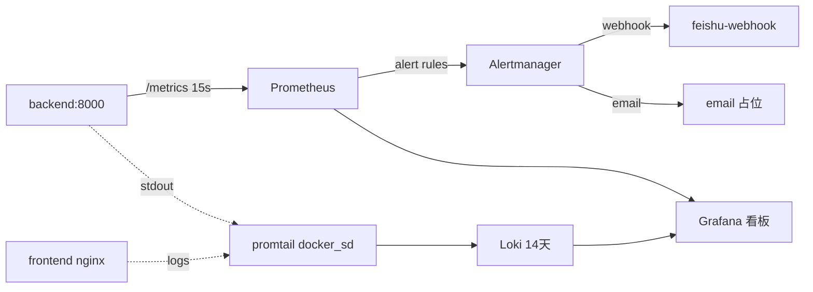
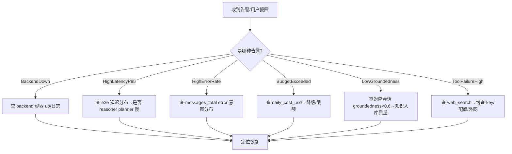

# 09 · 可观测性（OBSERVABILITY）

> **本文回答什么问题**：系统怎么监控？有哪些指标/日志/告警？出问题怎么查？
> **适合谁读**：运维、SRE、后端排障。
> **读完能做什么**：看懂 Grafana 面板与告警含义；按决策树定位故障；知道当前可观测性缺口。

> **数据源**：事实表 [.facts/T8-observability.md](./.facts/T8-observability.md)（23 指标<!-- fact:metrics_defined=23 --> + 12 告警<!-- fact:alert_rules=12 --> + file:line）。部署/操作命令见 `docs/ops/`。
> ⚠️ T8 事实表在「health 独立抓取 / 本地 JSON trace / record_llm_call 无调用方」三处已过时，以本文为准（待事实表同步）。

---

## 1. 监控拓扑

| 组件 | 镜像 | 说明 | 证据 |
|------|------|------|------|
| prometheus | prom/prometheus | 抓 backend/metrics(15s) + 自身；health 不单独抓（prometheus.yml:39-41）；30d/10GB；端口经 `MONITOR_BIND_IP` 绑定（生产=Tailscale IP） | monitoring.yml:26-60 |
| grafana | grafana/grafana | 自动 provisioning 看板 | monitoring.yml:63-99 |
| loki + promtail | grafana/loki, promtail | 日志采集；retention 14 天（336h） | monitoring.yml:102-144 |
| alertmanager | prom/alertmanager | 分级路由告警 | monitoring.yml:147-172 |
| feishu-webhook | sekb-feishu-webhook | 飞书通知；端口仅绑 `127.0.0.1:5001` | monitoring.yml:175-209 |

---

## 2. 指标字典（23 个自定义指标，`sekb_` 前缀）

> 全部埋点 try/except 吞异常（metrics.py:14,310-312）。暴露 `GET /metrics`（无鉴权）。

### 2.1 核心聊天指标（现役）
| 指标 | 类型 | 标签 | 含义 | 埋点 |
|------|------|------|------|------|
| sekb_messages_total | Counter | user_id(硬编码"default"), intent, status | 消息处理数/错误数 | chat.py 两端点 |
| sekb_e2e_latency_seconds | Histogram | —（bucket 至 120s） | 端到端延迟 | record_chat_metrics |
| sekb_llm_call_latency_seconds | Histogram | model, role（bucket 至 60s） | 单次 LLM 调用延迟 | record_llm_call（llm_factory.py:597） |
| sekb_llm_calls_total | Counter | model, role, status | LLM 调用（聚合 + 单次） | record_chat_metrics / record_llm_call |
| sekb_llm_tokens_total | Counter | model, direction | token 用量 | record_chat_metrics |
| sekb_llm_cost_usd_total | Counter | model | 成本累计 | record_chat_metrics |
| sekb_llm_retries_total / degradations_total | Counter | model/role | 重试/降级 | record_chat_metrics |
| sekb_daily_cost_usd | Gauge | — | 日成本（**只增不减**） | record_chat_metrics |
| sekb_replan_count_total | Counter | — | 重规划次数 | record_chat_metrics |
| sekb_answer_groundedness | Gauge | conversation_id | 最近一次锚定度（clear+set） | record_chat_metrics |
| sekb_tool_call_total | Counter | tool(硬编码 web_search), status | 工具成败 | record_chat_metrics |
| sekb_knowledge_ingest_total | Counter | status | 入库状态 | record_chat_metrics |
| sekb_service_health / subsystem_health | Gauge | subsystem | 服务/子系统健康 | health.py:81-85 |

### 2.2 客户端/认证指标（现役）
| 指标 | 说明 |
|------|------|
| sekb_client_events_total | 前端上报事件（event,level，白名单） |
| sekb_login_attempts_total / register_attempts_total | 登录/注册漏斗 |
| sekb_client_api_duration_seconds | 前端 api 请求耗时（perf 事件） |
| sekb_client_event_reports_total | 上报批次 accepted/rejected |

### 2.3 定义但**从未写入**（漂移 D-T8-1，现 3 项）
| 指标 | 问题 |
|------|------|
| sekb_conversations_total | 从未 inc——会话数不可观测（metrics.py:31-35） |
| sekb_reflection_pass_rate | 从未 set（metrics.py:113-116） |
| sekb_tool_call_latency_seconds | 从未 observe（metrics.py:144-149） |

> `sekb_llm_call_latency_seconds` 已于 2026-09 接线（`llm_factory.py:597` 调用 `record_llm_call`），不再属于本表。

> **口径缺口**：user_id 硬编码 "default"、tool 固定 "web_search"、daily_cost 无重置、groundedness 只留最近一次（T8 §8 D-T8-3/4/5/6）。

---

## 3. 日志规范

- **格式**：structlog JSON Lines；链：merge_contextvars→add_logger_name→add_log_level→TimeStamper(iso)→**脱敏**→StackInfo→format_exc_info（logging.py:57-65；renderer 67-70）。
- **脱敏**：字段名匹配 `api_key/authorization/token` → `"***REDACTED***"`（logging.py:28-37,54；默认值 config.py:334）。
- **输出**：stdout + `data/logs/app.log` 轮转 50MB×7（logging.py:92-103；config.py:331-333）。
- **上下文注入字段**：`trace_id` / `conversation_id` / `user_id`。注入点仅 2 处：chat.py:190（bind）、chat.py:248 finally clear；cli/chat.py:178-182/222。
- **⚠️ 无请求级中间件注入**：非 chat 路由日志字段靠调用点显式 kwargs。

---

## 4. 链路追踪（trace）现状

| 项 | 现状 | 证据 |
|----|------|------|
| 应用代码 | **零 OpenTelemetry / 零显式 langsmith span** | 全仓库 grep |
| 生效方式 | setup_tracing 写 `LANGSMITH_API_KEY/PROJECT/ENDPOINT`+`LANGCHAIN_TRACING_V2=true` env → 依赖 SDK 自动上报 | tracing.py:40-43 |
| trace 打通 | `get_trace_config` 把当前 trace_id/conversation_id 注入 LangChain RunnableConfig metadata/tags | tracing.py:57-79 |
| trace_id 业务化 | 每请求 uuid 存入 state/消息/响应 meta | chat.py:189-194 |
| 本地 JSON 兜底 | LocalTraceCollector **已按 D6 决策删除**（无消费方）——不再是缺口 | tracing.py:4-5；bootstrap.py:179 |

---

## 5. 告警规则（12 条 / 6 组，deploy/alerts.yml）

| 组 | 告警 | 表达式要点 | for | 级别 |
|----|------|-----------|-----|------|
| service_availability | BackendDown | `up{job="backend"}==0` | 1m | critical |
| service_availability | BackendDegraded | `sekb_service_health==0` | 2m | warning |
| service_availability | SubsystemUnhealthy | `sekb_service_subsystem_health==0` | 3m | warning |
| performance | HighLatencyP95 | P95 e2e > 15s | 5m | warning |
| performance | VeryHighLatencyP99 | P99 > 60s | 5m | critical |
| cost | BudgetExceeded | `sekb_daily_cost_usd > 5` | 10m | warning |
| cost | HighPerRequestCost | cost_rate/msg_rate > 0.05 | 10m | warning |
| quality | ReflectionFailureHigh | replan_rate > 0.5 | 10m | warning |
| quality | LowGroundedness | `sekb_answer_groundedness < 0.6` | 15m | warning |
| quality | LLMDegradationHigh | degrad_rate > 0.1 | 15m | warning |
| tools | ToolFailureHigh | failed/total per tool > 0.1 | 5m | critical |
| business | HighErrorRate | error/total > 0.05 | 5m | critical |

**Alertmanager 路由**：critical → feishu-critical（10s/1h）；warning → feishu-warning（1m/4h）；critical 抑制同源 warning（alertmanager.yml:36-54）。接收器飞书 webhook `http://feishu-webhook:5001/webhook` + email（占位）。

---

## 6. 故障排查决策树

**典型排障指引**：
1. **慢回复**：看 Grafana e2e 延迟 + 日志 thinking 时间点 → 通常是 planner（reasoner 15-35s）。见 02 §8。
2. **无回复/500**：查 error_id → 后端日志；SSE error 事件；`_conv_inflight` 是否互斥（同会话并发）。
3. **成本突增**：看 llm_cost_usd_total by model；news/job 批量任务放大调用（T3/T7）。
4. **健康探针**：`/live`（进程）、`/ready`（llm+graph）。`/metrics` 无鉴权，勿暴露公网（nginx 保护）。

---

## 7. 已知缺口（to-be 归 11）

- 3 个指标未埋点（conversations/reflection/tool_latency）→ 会话数/反思通过率/工具延迟不可观测（D-T8-1）；`record_llm_call` 已接线（llm_factory.py:597），LLM 单次延迟/角色维度已可见（D-T8-2 已闭环）。
- user_id/tool 标签失真；daily_cost 无重置；groundedness 无历史（D-T8-3/4/5/6）。
- 无请求级日志 context 注入；client-event 端点无鉴权依赖网关限流（D-T8-10）；本地 JSON trace 已删除（D-T8-9 闭环）。
- 监控栈无告警规则自监控（D-T8-11）。

---

## 相关文档

- [02-RUNTIME-FLOWS.md](./02-RUNTIME-FLOWS.md)
- [11-EVOLUTION.md](./11-EVOLUTION.md)
- [docs/ops/](../ops/)（部署操作手册）
- 事实表：[.facts/T8-observability.md](./.facts/T8-observability.md)
