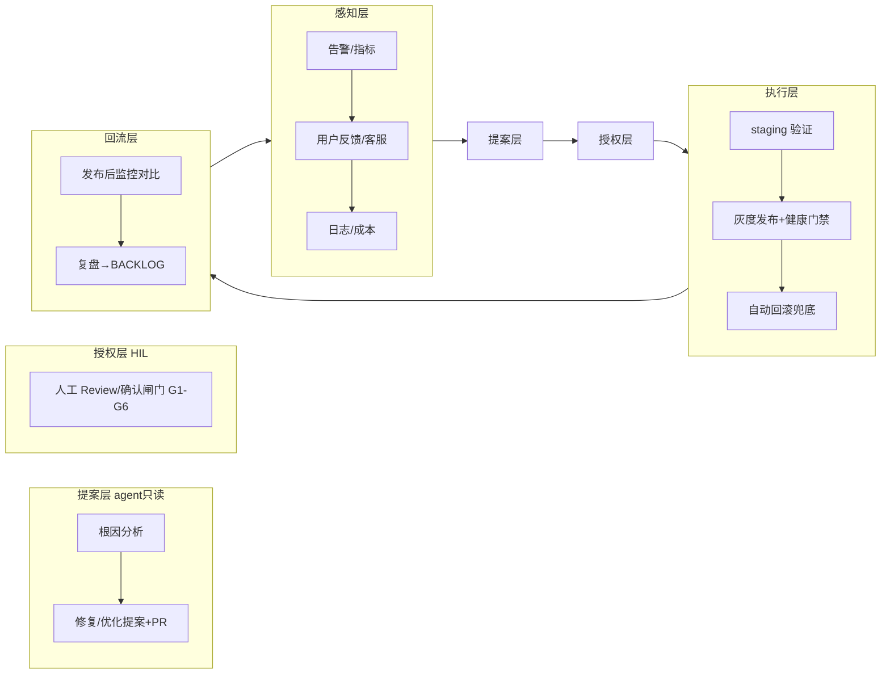
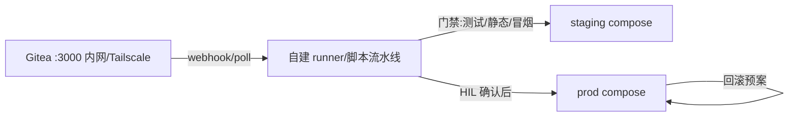
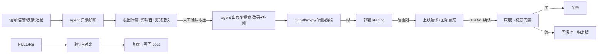

# 自迭代研发-运维闭环平台 · 设计 RFC（草稿讨论稿）

> **本文回答什么问题**：把「开发-调试-测试-上线-线上监控-客服运维-bugFix-功能优化-升级迭代」做成一个可自迭代、安全优先、关键环节人工确认（Human-In-Loop）的应用。本文是**讨论稿（RFC）**，非实施清单——细节讨论确认后才逐步实施。
> **存放位置**：`docs/tmp/`，讨论完成后整理进正式文档区。
> **状态**：draft，等待域名/平台等关键决策确认。

---

## 0. 决策记录（已与 Owner 确认）

| # | 决策 | 结论 |
|---|------|------|
| D-01 | 文档规模/方向 | 完整版；先建 RFC 持续讨论 |
| D-02 | Git 平台 | **服务器自建 Gitea + 自建流水线**为主方案；GitHub 降为归档镜像 |
| D-03 | 环境隔离 | staging 用**独立 compose + 空库/脱敏数据** |
| D-04 | HIL 授权粒度 | **保守：agent 只提案，全人工确认执行** |
| D-05 | 闭环触发 | **事件驱动 + 定期巡检** 两者结合 |
| D-06 | 首批实施范围 | **M0 安全/治理地基** + **M4 BugFix 半自动循环** |
| D-07 | 讨论稿位置 | `docs/tmp/`，后续整理为正式文档 |
| D-08 | 域名/入口 | A+C：子域名 staging./git.bos-studio.tech（无需新域名，加 DNS A + 证书扩 SAN）+ Tailscale 兜底 |
| D-09 | Gitea 部署 | Docker compose（monitoring 栈模式新增服务，数据卷持久化） |
| D-10 | 流水线载体 | 自建 bash/脚本流水线（bundle+scp 升级版，门禁+staging+HIL） |

---

## 1. 目标与背景

### 1.1 要解决的断点（as-is）
当前 SEKB 开发-运维闭环在这些环节断裂：
1. 告警只「通知」不闭环——没有 诊断→提案→授权→执行→验证 的链路；
2. 发布依赖人工 bundle+scp，无 staging/灰度/健康门禁/自动回滚的系统化支撑；
3. 线上指标/反馈没有回流成迭代输入；
4. GitHub 连接不稳定，remote 还带明文 PAT（安全红线）。

### 1.2 目标形态（to-be）
把闭环组织成一个 **agentic 平台**：感知 → 提案（agent 只读）→ 授权（HIL 人工）→ 执行 → 回流，六层闭环见 §2。

---

## 2. 总体架构（六层闭环）

---

## 3. Human-In-Loop 闸门（固定检查点）

| 闸门 | 内容 | 可自动？ | 备注 |
|------|------|---------|------|
| **G1** | 生产部署前人工确认 | 否 | 保守策略核心 |
| **G2** | 灰度放量比例/全量切换确认 | 否 | 人定比例 |
| **G3** | 代码变更进生产前 PR review 确认 | 否 | agent 只出 PR |
| **G4** | 生产数据/凭据/破坏性操作确认 | 否 | 永不自动 |
| **G5** | 自动回滚阈值/白名单由人批准 | 触发可自动；策略人定 | 回滚目标=上一稳定版 |
| **G6** | 降级/熔断/预算策略变更确认 | 否 | — |
| 通用 | agent 动作全程审计日志 | — | 谁/何时/改什么/关联提案号 |

---

## 4. Git 平台与流水线（M1 载体，按 D-02）

### 4.1 为什么 Gitea + 自建流水线
- 国内访问稳定；凭据不出本机；CI/CD 环节都落在自己的服务器上，闭环最短；
- 与现状 bundle+scp 兼容升级（把「手工步骤」固化为脚本/流水线步骤）；
- GitHub 降级为只读归档镜像（若需保留远端副本）。

### 4.2 目标拓扑（待细化）

### 4.3 待讨论细节
- Gitea 部署：容器（docker compose）挂什么卷、HTTPS 入口（见 §6 域名方案）；
- 流水线载体：Gitea Actions（内置，需启用）vs 自建 runner 脚本（bash 流水线，贴近现状）——倾向自建 runner 脚本 + 门禁函数库；
- 触发：PR/推送 hook 自动跑 staging；prod 发布由「HIL 确认」步骤触发。

---

## 5. M0 安全/治理地基（首批，按 D-06）

### M0-1 凭据治理（先止血）
- [ ] 移除 remote 明文 PAT（`ghp_...`），改用 SSH key 或 Gitea；
- [ ] 全仓排查残留 PAT/密钥引用（含文档、CI）；
- [ ] `.env.prod` 迁移进服务器 secret 目录（权限 600）或 docker secret，不入 git；
- [ ] 列密钥清单 → 逐项替换并验证。

### M0-2 环境隔离（staging）
- [ ] `docker-compose.staging.yml`：独立卷/端口/域名子路径；
- [ ] staging 数据：空库或脱敏副本，禁止连 prod 数据；
- [ ] 每 PR/提案自动部署 staging 跑 测试+冒烟+健康。

### M0-3 操作规约与审计
- [ ] 写《变更与发布操作规约》（进 docs/ops）：定义 G1-G6、批准人、记录格式；
- [ ] 发布/回滚/灰度/数据操作审计日志；
- [ ] 告警卡片与发布确认带「提案号」可追溯。

### M0-4 仓库基线
- [ ] BACKLOG 引入「提案」概念模板；
- [ ] docs/tech 联动保持。

---

## 6. staging/平台入口域名方案（待 Owner 确认）

背景：云服务器域名 `bos-studio.tech`，当前 nginx 已托管 `/sekb/` 应用与 HTTPS。staging 与 Gitea 需独立入口。候选：

### 方案 A：子域名 + 独立 nginx server（推荐）
- `staging.bos-studio.tech` → staging 应用；
- `git.bos-studio.tech` → Gitea；
- 需在 DNS 添加两条 A 记录指向同一服务器 IP；
- nginx 增加两个 server_name 段（各自 TLS，可用同一证书通配或分别签）。
- 优点：隔离清晰、无路径冲突、SPA base 简单；缺点：需 DNS 与证书操作。

### 方案 B：子路径（`bos-studio.tech/staging/`、`/git/`）
- 不加 DNS；nginx location 分流。
- 优点：零 DNS 改动；缺点：SPA/vite base 需带前缀、易与现 /sekb 混、隔离弱。

### 方案 C：仅内网 + Tailscale（最安全）
- staging 与 Gitea 只经 Tailscale 访问（不公网暴露），手机/办公网经 Tailscale；
- 优点：安全第一，符合 M0；缺点：外出无 Tailscale 时不可访问。
- 可与 A 结合：staging 走 Tailscale，正式流水线由服务器内部触发即可。

**已确认：A+C（子域名 + Tailscale 兜底）**——git.bos-studio.tech → Gitea、staging.bos-studio.tech → staging；正式流水线全内网；可先 C 后 A（先 Tailscale 内网，公网子域名后置）。

**关于"是否要新域名"的澄清**：
- 子域名属于已有域名 `bos-studio.tech`，**无需新申请**；
- 实际成本 = ① 域名服务商 DNS 加 2 条 A 记录指向服务器 IP；② 证书扩 SAN（certbot 同命令加 `-d`）或签通配 `*.bos-studio.tech`（DNS challenge）；
- 也可先纯 C（Tailscale 自带 TLS，零 DNS/证书），公网子域名后置。

---

## 7. M4 BugFix 半自动循环（首批，按 D-06）

### 7.1 一条 BugFix 的完整旅程

### 7.2 首批 runbook（按 D-06/4 建议）
| # | 故障 | 诊断要点 | 处置 |
|---|------|---------|------|
| R-01 | 告警阈值误报/疲劳 | 指标口径缺陷（daily_cost 只增、groundedness 只留最近、死指标） | 修口径/埋点，HIL 后上 |
| R-02 | 首 token 慢 | planner reasoner 时长、RAG 冷启动、TTFT | 优化/降级/缓存（涉 ADR） |
| R-03 | ChromaDB 段损坏/检索空 | 备份、原始文件、重嵌入脚本 | **严格人工** 停服→备份→重建 |
| R-04 | embedding 冷加载慢 | HF 缓存、etag | 预热/离线缓存 |

### 7.3 运行方式
- 事件驱动：告警/反馈 → 会话代理按 R-xx 流程推进到 HIL 点等确认；
- 定期巡检：每周/季度拉指标+告警+BACKLOG → 生成迭代提案清单 → 人工确认；
- agent 全程只读（不持生产写凭据）；staging 可自动；prod 操作 HIL。

---

## 8. 安全红线（写入规约）

1. 生产写操作默认人工（G1-G6 之外一律人工）；
2. 只读诊断 agent 不持有写凭据；
3. staging 先于 prod；prod 发布前自动备份；
4. 自动回滚阈值保守；回滚目标=上一稳定版；
5. agent 动作全程审计；
6. 敏感操作（凭据/数据）永不自动；
7. 新模块先在 staging 全量测试+冒烟。

---

## 9. 风险与开放问题（待讨论）

| 项 | 问题 | 倾向 |
|----|------|------|
| O-01 | Gitea 与自建流水线的运维负担 vs 收益 | 可接受（个人单机） |
| O-02 | staging 与 prod 共用服务器资源，隔离度 | 独立端口+卷，容器网络隔离 |
| O-03 | 自动回滚触发条件与人工兜底 | 先人工确认回滚；后续加"阈值触发+自动回滚"（G5 批准后） |
| O-04 | 定期巡检周期 | 周轻量+季度全量（对齐 check-freshness） |
| O-05 | 反馈入口形态（表单/飞书） | 待定 |
| O-06 | 评估门禁（eval 转阻断）严格度 | 固定 CI key 后转阻断 |

---

## 10. 关联文档

- 现状盘点：`docs/tech/09-OBSERVABILITY.md`、`docs/tech/10-TESTING.md`、`docs/tech/11-EVOLUTION.md`
- 运维手册：`docs/ops/`（部署/排障现状）
- 待办：`docs/BACKLOG.md`
- 变更：`docs/CHANGELOG.md`
